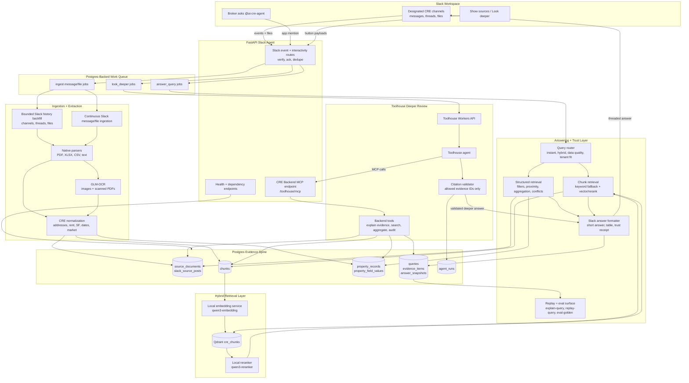

# CRE Knowledge Engine

CRE Knowledge Engine is a Slack-native AI agent for Commercial Real Estate teams. It turns the messy information brokers already share in Slack - listing flyers, spreadsheets, field notes, corrections, market reports, and tenant requirements - into source-grounded answers inside Slack.

The product bet is simple: CRE users do not need another generic chatbot. They need a teammate that can say which property fits, where the fact came from, why one conflicting value won, and whether a deeper Toolhouse review stayed inside the evidence boundary.

## What It Proves

- Answers precise CRE questions from Slack-visible messages and files with citations.
- Parses PDFs, XLSX, CSV, text, images, and scanned documents into normalized property facts.
- Keeps field-level provenance for square footage, rent, availability, market, source rows/pages, Slack sender, channel, and timestamp.
- Uses deterministic Postgres retrieval for exact facts, filters, proximity, aggregation, and conflict resolution.
- Uses Qdrant plus local embeddings/reranking for hybrid source-text questions such as loading access or yard space.
- Exposes `Show sources` and `Look deeper` actions in Slack.
- Sends bounded Toolhouse synthesis through backend evidence tools, then validates every returned citation before posting.
- Provides replayable trust receipts for answers, golden evals, demo dry runs, and final submission checks.

Current proof points:

- `uv run pytest -q` passes 81 tests with no known failures or warning noise.
- `uv run cre-cli demo-doctor --live-toolhouse` returns `ready`, including public callback health and live Toolhouse validation with no local fallback.
- `uv run cre-cli demo-dry-run --live-toolhouse` passes the recording query sequence and returns replay commands for each answer.
- `uv run cre-cli secret-scan` scans source, docs, config, and sample files with 0 findings.

## Architecture



The core boundary is intentional: Postgres is the system of record for sources, facts, evidence, jobs, answer snapshots, and agent runs. Toolhouse handles deeper synthesis, but the backend owns retrieval, tool outputs, and citation validation.

## The Slack Experience

A broker can ask:

| Slack prompt | What the agent demonstrates |
| --- | --- |
| `What properties do we have available near 123 Main Street?` | Proximity search over normalized property records with sourced nearby results. |
| `Show office buildings under $50/sq ft.` | Exact structured filtering that excludes higher-priced office inventory. |
| `Find listings that mention loading access or yard space.` | Hybrid retrieval over source text and field notes, with keyword fallback and Qdrant/rerank support. |
| `Why did you use 62k sq ft for Harbor Rd?` | Freshness and authority conflict handling with selected, supporting, and superseded evidence. |
| `Look deeper` | Toolhouse-backed synthesis over the allowed evidence bundle, with backend citation validation. |

Every factual answer includes a compact trust receipt: route label, evidence count, reason for selection, and source boundary. `Show sources` opens the evidence trail. `replay-query` reconstructs the stored answer snapshot outside Slack.

## Why It Is Credible

CRE data is full of small, expensive contradictions: one spreadsheet says 58,000 SF, a later correction says 62,000 SF, and a Slack thread explains which source to trust. This project treats those details as the product, not as prompt decoration.

The implementation favors boring reliability where facts matter:

- Slack is acknowledged quickly; slow parsing, indexing, answering, and Toolhouse calls run through background jobs.
- Live ingestion is conservative so generic chatter does not become source truth.
- Source appearances are modeled separately from canonical documents, so repeated Slack shares keep provenance without duplicating facts.
- Golden evals verify routes, expected addresses, source labels, reason codes, evidence order, and dependency state.
- Agent runs persist Toolhouse/local deeper-review traces, raw responses, parsed payloads, citation validation, fallback state, and rendered output.

## Try It Locally

This repo uses Python 3.12 and `uv`.

```bash
uv sync
make recover-demo
uv run cre-cli import-samples
uv run cre-cli index-chunks --reset
uv run cre-cli demo-doctor --skip-public-callback
```

Ask a local question:

```bash
uv run cre-cli ask "Show office buildings under $50/sq ft."
```

Replay the resulting answer:

```bash
uv run cre-cli replay-query <query-id>
```

Run the final readiness path:

```bash
make demo-check
make submission-report
```

For the live Slack demo, the current workstation path uses:

- FastAPI app: `http://127.0.0.1:8020`
- Public callback: `https://slack.aqwerty321.me`
- Qdrant collection: `cre_chunks`
- Embeddings: `qwen3-embedding-0_6b-q8_0`
- Rerank: `qwen3-reranker-0.6b`
- OCR: GLM-OCR at `http://127.0.0.1:5003`
- Toolhouse Agent ID: `0c2c4555-5d96-47e4-8e05-f956de7a102e`

Use `.env.example` as the non-secret template. Local `.env` values are intentionally excluded from the source secret scan.

## Reviewer Commands

```bash
uv run pytest -q
uv run cre-cli eval-golden
uv run cre-cli demo-doctor --live-toolhouse
uv run cre-cli demo-dry-run --live-toolhouse
uv run cre-cli secret-scan
uv run cre-cli submission-report --format markdown --output .runtime/submission-report.md
```

## Project Shape

- [app/main.py](app/main.py) creates the FastAPI app and worker lifecycle.
- [app/slack/](app/slack) owns Slack intake, answer rendering, source actions, and demo seeding.
- [app/ingestion/](app/ingestion) handles sample import, Slack backfill, live ingestion, source provenance, and quality checks.
- [app/extraction/](app/extraction) parses native files and routes image/scanned-document OCR.
- [app/retrieval/](app/retrieval) and [app/routing/](app/routing) implement structured, hybrid, tenant-fit, and data-quality retrieval.
- [app/answering/query_service.py](app/answering/query_service.py) writes queries, evidence items, answer snapshots, and explanation payloads.
- [app/toolhouse/](app/toolhouse) contains the Workers API client, bounded local fallback, MCP server, backend tools, and citation validator.
- [app/evaluation/](app/evaluation) provides golden evals, replay, demo doctor, demo dry run, secret scan, and submission report generation.
- [tests/](tests) covers golden answers, Slack loop behavior, ingestion, parsers, Toolhouse tools/client/MCP, and readiness commands.

## Submission Notes

- Demo video script: [docs/slack-demo-video-script.md](docs/slack-demo-video-script.md)
- Demo runbook: [docs/slack-demo-runbook.md](docs/slack-demo-runbook.md)
- Sample data and evaluation plan: [docs/sample-data-and-evaluation.md](docs/sample-data-and-evaluation.md)
- Production practices and trade-offs: [docs/production-practices.md](docs/production-practices.md)
- Toolhouse readiness checkpoint: [docs/toolhouse-readiness-checkpoint.md](docs/toolhouse-readiness-checkpoint.md)
- Generated submission report: [.runtime/submission-report.md](.runtime/submission-report.md)

Hardest part: keeping Slack ingestion, document extraction, retrieval, citations, Slack actions, and Toolhouse synthesis aligned around replayable evidence IDs.

Main trade-off: I chose a deterministic evidence spine and Postgres-backed jobs over adding orchestration frameworks for show. The result is less flashy internally, but more defensible in a CRE workflow where exact rent, square footage, availability, and source provenance matter.

With two more weeks: add production OAuth and multi-workspace permissions, admin review UI for low-confidence extraction, object storage for files, telemetry dashboards, external geocoding and drive-time search, retrieval benchmark snapshots, and retention/deletion workflows for Slack-originated data.