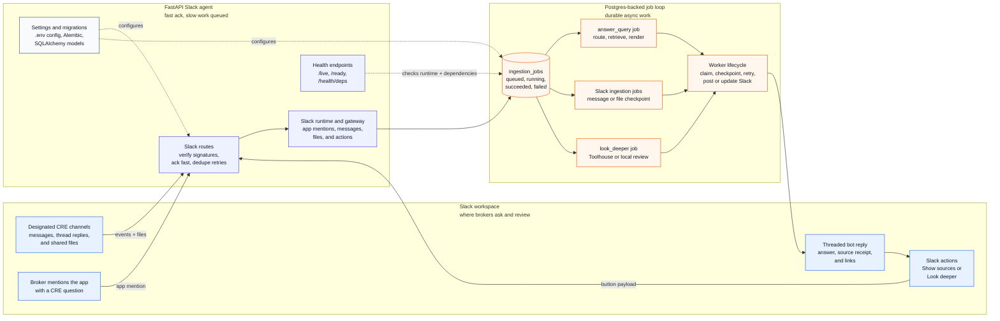
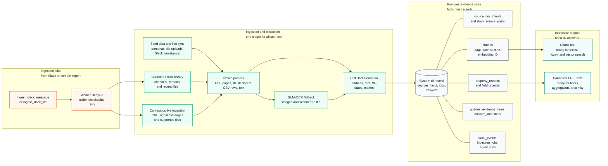
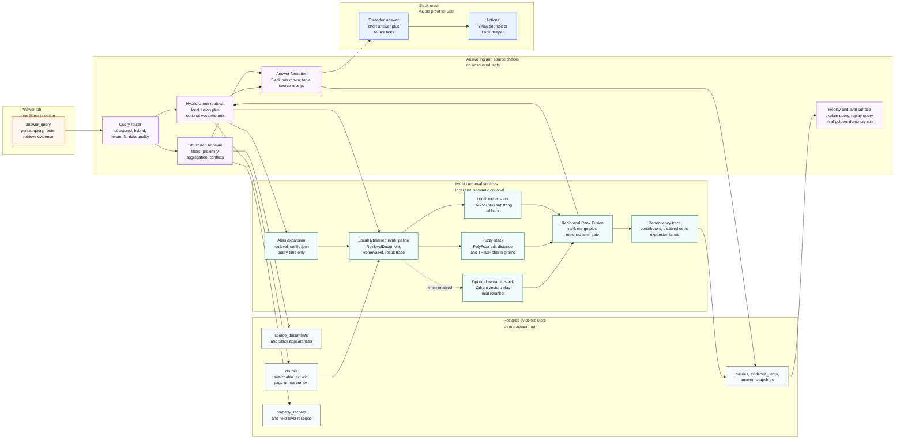
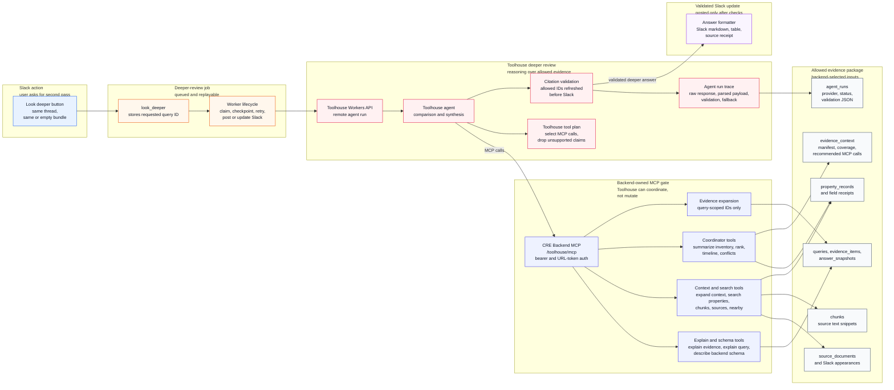
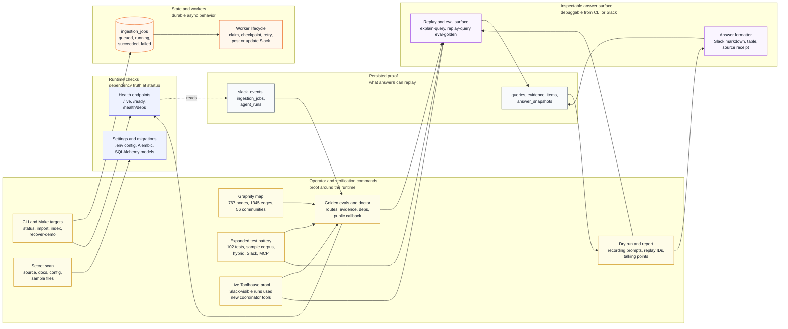
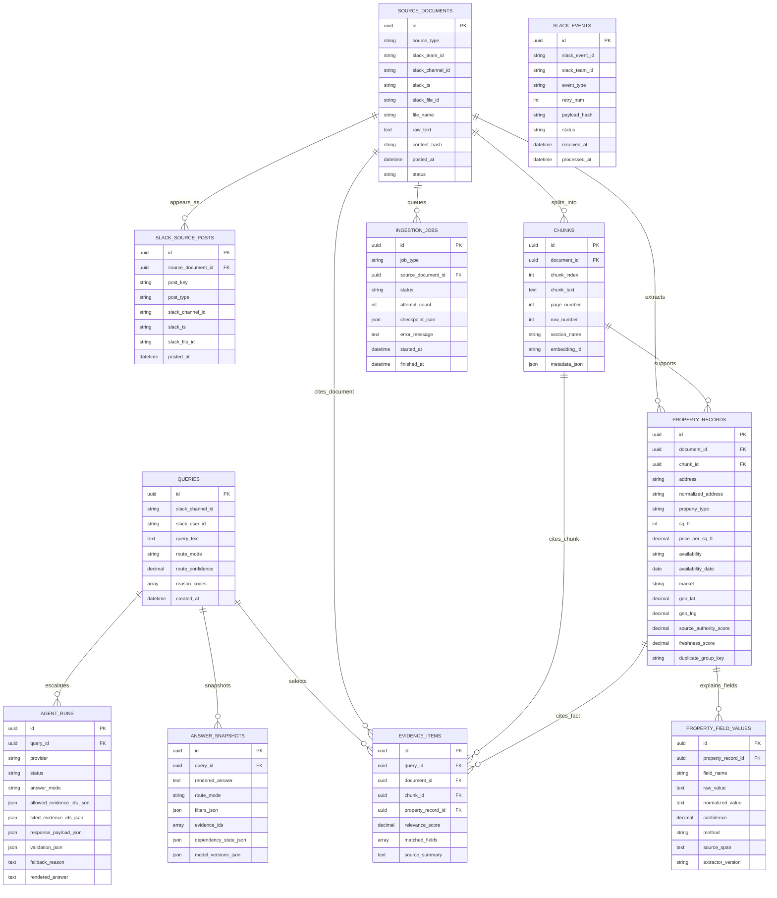

# CRE Knowledge Engine

CRE Knowledge Engine is a Slack app for commercial real estate teams. It reads the material brokers already trade in Slack - listing flyers, spreadsheets, field notes, corrections, market updates, and tenant requirements - and answers questions with the source trail attached.

The point is not to make Slack feel like a chatbot. The point is to help a broker ask, "Which properties fit?", then see the row, page, message, or correction that supports the answer. If two sources disagree, the app explains which one won and why. If the user asks for a deeper review, Toolhouse can reason over the same evidence bundle, but the backend still checks the citations before anything is posted.

## What The System Covers

- It answers CRE questions from Slack messages and files, and it cites where the answer came from.
- It parses PDFs, XLSX, CSV, text files, images, and scanned documents into usable property facts.
- It keeps the useful receipt for each fact: square footage, rent, availability, market, source row or page, Slack sender, channel, and timestamp.
- It uses Postgres for exact facts: filters, proximity, aggregation, source lookup, and conflict handling.
- It uses BM25S, PolyFuzz, TF-IDF character n-grams, optional Qdrant, and reranking when the question depends on source text, such as loading access or yard space.
- It gives the user Slack actions: `Show sources` for supporting rows/pages/messages, and `Look deeper` for Toolhouse review or a zero-evidence recovery pass.
- It also supports `/force-agent`, a `Force agent` button, a message shortcut, and thread-aware auto-escalation when a contextual follow-up looks too ambiguous for the local router.
- It lets Toolhouse coordinate through a narrow MCP surface for schema, context, search, aggregation, inventory summaries, rankings, timelines, conflicts, and query-scoped evidence expansion.
- It validates Toolhouse citations against backend evidence IDs before posting a deeper answer.
- It can replay answers, run golden evals, execute readiness checks, and generate a submission report.

Current verification:

- `uv run pytest -q` passes 102 tests with no known failures or warning noise.
- `uv run cre-cli demo-doctor --live-toolhouse` returns `ready`, including public callback health and live Toolhouse validation with no local fallback.
- `uv run cre-cli demo-dry-run --live-toolhouse` passes the recording query sequence and returns replay commands for each answer.
- Two live Slack-visible Toolhouse runs used the new MCP coordinator tools (`summarize_inventory`, `rank_properties`, and `find_property_conflicts`) with backend validation and no fallback.
- `uv run cre-cli secret-scan` scans source, docs, config, and sample files with 0 findings.

## Architecture

The full system is easier to read in pieces. These five diagrams show the main loops: Slack intake, ingestion, retrieval, Toolhouse review, and the verification surface around the runtime.

### 1. Slack Intake And Job Loop



### 2. Ingestion To Evidence Store



### 3. Retrieval And Answering



### 4. Toolhouse Can Review, Not Invent



### 5. Verification And Readiness Loop



The diagrams are split on purpose. The first five show the running system without turning everything into one unreadable graph. The README coverage was checked against a fresh Graphify rebuild, which now shows 767 nodes, 1345 edges, and 56 communities. That pass made the less-visible pieces explicit: local hybrid retrieval, CLI checks, worker state, Slack delivery, Toolhouse MCP auth, and the verification loop.

The key rule is simple: Postgres keeps the source trail, facts, jobs, selected evidence, answer snapshots, and Toolhouse run logs. Toolhouse can coordinate a smarter second pass through MCP, but the backend still owns the facts and citation gate.

## How Data Gets In

The app has three ways to learn about CRE data: a local sample import for repeatable demos, a bounded historical Slack backfill, and live Slack events. All three paths are shaped into the same internal dataset model before parsing, extraction, storage, and indexing. That is intentional: a golden query against local sample data should exercise the same tables and answer code as a query against live Slack data.

```mermaid
%%{init: {"flowchart": {"htmlLabels": true, "curve": "basis", "nodeSpacing": 48, "rankSpacing": 62, "wrappingWidth": 190}, "themeVariables": {"fontSize": "13px"}} }%%
flowchart LR
    classDef entry fill:#e8f2ff,stroke:#2563eb,color:#111827
    classDef gate fill:#fff7ed,stroke:#ea580c,color:#111827
    classDef resolve fill:#eef2ff,stroke:#4f46e5,color:#111827
    classDef parse fill:#ecfdf5,stroke:#059669,color:#111827
    classDef store fill:#f8fafc,stroke:#475569,color:#111827
    classDef quality fill:#fefce8,stroke:#ca8a04,color:#111827

    subgraph E["Entry points<br/>three ways data arrives"]
        direction TB
        E1["Local sample import<br/>manifest plus sample files"]
        E2["Historical Slack backfill<br/>recent channel history<br/>and thread replies"]
        E3["Live Slack events<br/>message and file_shared<br/>callbacks"]
    end

    subgraph G["Gate and queue<br/>ack fast, process later"]
        direction TB
        G1["Allowed channels<br/>disabled, files_only,<br/>listings_only, evidence"]
        G2["Noise checks<br/>bots, empty events,<br/>unsupported subtypes,<br/>query-like chatter"]
        G3[("slack_events<br/>retry metadata<br/>and payload hash")]
        G4[("ingestion_jobs<br/>message and file<br/>checkpoints")]
    end

    subgraph R["Resolve source<br/>Slack metadata becomes importer input"]
        direction TB
        R1["Message checkpoint<br/>permalink plus raw<br/>Slack text"]
        R2["File checkpoint<br/>files.info, title/name match,<br/>private download"]
        R3["SampleDatasetModel<br/>same shape for<br/>sample and live"]
    end

    subgraph P["Parse and extract<br/>source-aware chunking"]
        direction TB
        P1["Native parsers<br/>CSV rows, XLSX sheets,<br/>PDF pages, text"]
        P2["OCR fallback<br/>GLM-OCR for images<br/>and scanned PDFs"]
        P3["CRE signal extraction<br/>address, type, SF, rent,<br/>availability, market"]
    end

    subgraph S["Persist, index, and audit<br/>source trail stays attached"]
        direction TB
        S1[(source_documents)]
        S2[(slack_source_posts)]
        S3[("chunks<br/>page, row, section")]
        S4[(property_records)]
        S5[(property_field_values)]
        S6["Optional vector indexing<br/>Qdrant embedding IDs"]
        S7["Quality report<br/>missing fields, context-only<br/>sources, conflicts"]
        S8["Retention cleanup<br/>old context and<br/>download pruning"]
    end

    E1 --> R3
    E2 --> G1
    E3 --> G1
    G1 --> G2
    G2 --> G3
    G3 --> G4
    G4 --> R1
    G4 --> R2
    R1 --> R3
    R2 --> R3
    R3 --> P1
    P1 --> P2
    P1 --> P3
    P2 --> P3
    P3 --> S1
    P3 --> S2
    P3 --> S3
    P3 --> S4
    P3 --> S5
    S3 --> S6
    S1 --> S7
    S4 --> S7
    S1 --> S8 --> S7

    class E1,E2,E3 entry
    class G1,G2,G3,G4 gate
    class R1,R2,R3 resolve
    class P1,P2,P3 parse
    class S1,S2,S3,S4,S5,S6 store
    class S7,S8 quality
```



Historical backfill is deliberately bounded. The worker asks Slack for recent channel history, walks thread replies, and imports only messages or files that pass the same channel policy and CRE-signal checks used by live events. It counts what it saw and what it imported, but it does not treat generic conversation as evidence just because it appeared in a configured channel.

Live ingestion is also conservative. Each Slack delivery is recorded in `slack_events` with retry metadata and a payload hash. Duplicate Slack event IDs are ignored, unconfigured channels are skipped, and allowed events become `ingestion_jobs` with enough checkpoint data to replay the work: team, channel, user, message timestamp, thread timestamp, raw text, or file metadata.

Message jobs and file jobs converge quickly. A message job resolves the Slack permalink and stores the message text. A file job resolves Slack file metadata, downloads supported files into the local Slack download directory, and records file name, MIME type, Slack file ID, source URL, and local path. From there both paths use `SampleDatasetModel`, so local demos and live Slack ingestion share the same importer.

Parsing is source-aware. CSV files become row chunks. XLSX files become sheet-and-row chunks. PDFs keep page numbers when text extraction works; scanned PDFs and images go through GLM-OCR when OCR is enabled. Text files and Slack messages stay as text chunks. Those chunks feed heuristic CRE extraction for addresses, property type, square footage, rent, availability, market, source authority, freshness, and confidence.

Import is an upsert, not a blind append. The importer checks Slack file IDs, Slack message timestamps, local paths, and content hashes to reuse existing sources where appropriate. Before re-importing a source, it clears old child chunks, property records, and source-scoped jobs, then writes fresh chunks, property records, field values, Slack source appearances, and succeeded extract/index job records. If vector indexing is enabled, new chunk IDs are embedded and written to Qdrant.

There is also a cleanup path for live Slack storage. It can remove old Slack-message context that never produced property facts, release old file-download paths from source records, and delete orphaned local downloads under configured retention windows. It skips sources with active jobs and keeps property-backed sources intact.

The quality checks are part of ingestion, not an afterthought. The importer records validation warnings for duplicate source IDs, missing source text, duplicate chunk indexes, property rows pointing at missing chunks, sources without property records, and property records missing important fields. The data-quality answer later reports those gaps directly to the user.

## How Data And Routing Work

The implementation follows one rule: if the app says a fact in Slack, that fact should point back to a stored source, a normalized property record, or an evidence item. The core code is in [app/models/core.py](app/models/core.py), [app/routing](app/routing), [app/retrieval](app/retrieval), [app/answering/query_service.py](app/answering/query_service.py), and [app/toolhouse](app/toolhouse).

### Database Schema



How the schema is meant to be read:

- `source_documents` is the canonical source table. It covers Slack messages, thread replies, PDFs, CSVs, XLSX files, text notes, and OCR output.
- `slack_source_posts` records where a source showed up in Slack, so repeated shares keep their own channel, sender, timestamp, and permalink context.
- `chunks` holds the text used for search. Page, row, section, embedding ID, and metadata stay attached to the chunk.
- `property_records` stores facts as they appeared in a source. It does not try to merge everything into one perfect property entity too early. Likely duplicates are grouped with `duplicate_group_key` and resolved when an answer is built.
- `property_field_values` keeps the field-level audit trail: raw value, normalized value, confidence, method, source span, and extractor version.
- `queries`, `evidence_items`, and `answer_snapshots` are the answer trail. `Show sources`, `explain-query`, `replay-query`, and Toolhouse escalation all read from that trail.
- `agent_runs` stores the deeper-review trace: allowed evidence IDs, cited evidence IDs, parsed response, validation result, fallback reason, raw response, and final rendered answer.
- `slack_events` and `ingestion_jobs` keep Slack acknowledgement separate from slow work.

### How Routing Works

```mermaid
%%{init: {"flowchart": {"htmlLabels": true, "curve": "basis", "nodeSpacing": 48, "rankSpacing": 62, "wrappingWidth": 190}, "themeVariables": {"fontSize": "13px"}} }%%
flowchart LR
    classDef question fill:#e8f2ff,stroke:#2563eb,color:#111827
    classDef router fill:#eef2ff,stroke:#4f46e5,color:#111827
    classDef retrieval fill:#f0fdfa,stroke:#0f766e,color:#111827
    classDef evidence fill:#f8fafc,stroke:#475569,color:#111827
    classDef slack fill:#fff7ed,stroke:#ea580c,color:#111827
    classDef agent fill:#fff1f2,stroke:#e11d48,color:#111827

    Q["Slack question<br/>plain broker wording"] --> P["build_query_plan<br/>records route, confidence,<br/>reason codes"]
    P --> C["Query constructor<br/>inventory intent, addresses,<br/>markets, prices, size,<br/>timing, tenant-fit intent"]
    C --> S{"Route decision<br/>deterministic plan"}
    S -->|structured instant| I["Structured Postgres path<br/>filters, proximity,<br/>aggregation, conflicts"]
    S -->|local hybrid| X["Alias expansion<br/>query-time only,<br/>retrieval_config.json"]
    X --> H["LocalHybridRetrievalPipeline<br/>BM25S, substring,<br/>PolyFuzz, TF-IDF char n-grams"]
    H --> F["Reciprocal Rank Fusion<br/>rank merge plus<br/>feature-term gate"]
    F --> O["Optional semantic pass<br/>Qdrant candidates plus<br/>local reranker"]
    S -->|unsupported| U["Supported-pattern response<br/>no guessing, no fabricated listing"]
    I --> E["EvidenceItem rows<br/>selected source, chunk,<br/>or property fact"]
    O --> E
    U --> A["AnswerSnapshot<br/>saved answer and<br/>dependency state"]
    E --> A
    A --> B["Slack answer blocks<br/>source receipt, table,<br/>actions"]
    B --> D["Show sources<br/>ephemeral evidence view"]
    B --> L["Look deeper<br/>queue agent review"]
    L --> T["Toolhouse agent mode<br/>allowed evidence or<br/>safe broadening path"]

    class Q question
    class P,C,S router
    class I,X,H,F,O retrieval
    class E,A evidence
    class B,D,L slack
    class T agent
```



The router is small by design. For each question it writes down the route, query type, confidence, reason codes, and filters it used. A few golden paths cover the highest-value operating questions. The generic query constructor handles the broader cases: broad inventory wording, property type aliases, known addresses, markets, uploader names, keywords, price and size thresholds, availability windows, aggregation, sorting, limits, missing-data terms, and tenant-fit wording.

| Query class | Route | What happens |
| --- | --- | --- |
| Proximity | `instant` | Recognizes seeded anchors like `123 Main Street`, computes Haversine distance from stored coordinates, sorts nearest available properties, and cites the supporting source rows. |
| Numeric filters | `instant` | Turns prompts like office under `$50/SF` into SQL predicates over `property_type` and `price_per_sq_ft`. |
| Aggregation | `instant` | Resolves source/uploader references such as John's industrial files, dedupes by `duplicate_group_key`, and sums `sq_ft` in Postgres. |
| Exact/source lookup | `instant` | Matches normalized address plus field value, then returns the source rows/pages where the value appeared. |
| Conflict review | `hybrid` | Uses a duplicate group such as Harbor Rd, orders candidates by source authority, freshness, and posting time, then labels evidence as selected, supporting, or superseded. |
| Loading or yard language | `hybrid` | Expands aliases such as dock doors, truck court, and trailer parking, then fuses BM25, substring, PolyFuzz edit distance, TF-IDF character n-gram, and optional Qdrant/rerank candidates. |
| Inventory overview | `instant` | Treats prompts like `list all properties` or `what do we have` as a broad structured query, returns a sourced inventory snapshot, and leaves a ready evidence bundle for `Look deeper`. |
| Generic structured search | `instant` | Builds a transparent query constructor with conditions, sort, and limit, then returns deduped structured matches. |
| Tenant fit | `hybrid` | Runs a local heuristic over price, size, availability, source quality, and logistics terms, then invites `Look deeper` for Toolhouse review. |
| Data quality | `instant` | Scans indexed sources and property rows for missing fields, sources without chunks/properties, and duplicate groups with conflicting numeric facts. |
| Unsupported | `failed` | Refuses to guess, returns the supported query patterns, and still offers `Look deeper` so Toolhouse can broaden through MCP or report missing evidence. |

One important detail: `hybrid` does not mean the agent is improvising. It still means backend retrieval. The answer service finds the evidence, writes the evidence rows, records dependency state, and only then posts to Slack.

### Scoring And Ranking

The ranking rules are meant to be easy to audit:

- Structured matches score field coverage plus source quality: matched-field count, `source_authority_score`, `freshness_score`, and extraction confidence. Dedupe keeps the strongest row per `duplicate_group_key`.
- Sort requests are explicit: cheapest sorts by `price_per_sq_ft`, largest by `sq_ft`, and soonest availability by `availability_date`.
- Generic structured searches return the top deduped records after filters and sort. Exact lookups can keep multiple rows so source agreement or conflict is visible.
- Loading-access retrieval uses configurable alias expansion, BM25S lexical ranking, PolyFuzz edit-distance matching, TF-IDF character n-grams, optional Qdrant candidates, and Reciprocal Rank Fusion. A listing that matches multiple concrete feature terms still outranks a weaker partial match, all else equal.
- Vector retrieval combines Qdrant and rerank scores as `0.35 * vector_score + 0.65 * rerank_score` when rerank is available; otherwise it uses the clamped vector score.
- Tenant-fit local scoring uses source quality, near-term availability, price under `$35/SF`, scale above `15,000 SF`, and logistics terms such as loading dock, yard, and trailer storage.

### Missing Values, Conflicts, And No Results

Missing data is handled directly instead of being hidden behind a confident answer.

- Missing fields stay missing. Renderers say `unknown SF`, `unknown price`, or `availability unknown`; they do not infer values from similar listings.
- Data-quality questions route to a database report over critical fields: address, property type, square footage, rent, availability, market, coordinates, and source URL.
- Sources with chunks but no property rows are reported as context-only evidence. They can support source-text search, but they do not become structured facts until extraction can point at a real span.
- No-result structured queries call a relaxed matcher that removes numeric/date blockers and returns closest sourced rows when useful. The answer says which filters were applied and never fabricates a listing.
- Conflicting duplicate groups are answerable. Harbor Rd, for example, can explain why the fresher 62,000 SF correction outranks an older 58,000 SF inventory row while still citing the superseded source.
- Field-level receipts live in `property_field_values`, so a final answer can show not only the normalized value but also the raw value, method, confidence, source span, and extractor version.

### Hybrid Search And Vector Fallbacks

Hybrid search is conservative. Local lexical and fuzzy retrieval are the baseline; Qdrant can add semantic candidates when it is enabled, but Postgres still owns the source, property record, citation, and saved answer.

1. Query-time expansion reads [app/retrieval/retrieval_config.json](app/retrieval/retrieval_config.json). The source corpus is not mutated; the expanded terms live only on the query path and are recorded in `dependency_state_json`.
2. BM25S ranks the in-memory chunk corpus lexically. A standard-library substring retriever remains available as a simple fallback when exact configured terms are enough.
3. PolyFuzz edit distance handles typos, shorthand, partial names, and alias phrasing. TF-IDF character n-grams add another lightweight signal for noisy text overlap.
4. Optional Qdrant retrieval embeds `chunks.chunk_text` with `qwen3-embedding-0_6b-q8_0`, retrieves `cre_chunks`, and joins candidate chunk IDs back to Postgres. The existing `qwen3-reranker-0.6b` endpoint is exposed as a final rerank hook when vector search is enabled.
5. Candidate lists are merged with Reciprocal Rank Fusion, so each layer can keep its own scoring scale. Final evidence is deduped by `duplicate_group_key`, scored with relevance, authority, freshness, and matched feature coverage, then persisted exactly like structured evidence.
6. Loading-access search still requires concrete expanded-term hits in the chunk text. A broad semantic match without the expected source language does not become evidence.
7. `dependency_state_json` records layer status, contributors, query expansion terms, Qdrant/rerank usage, and disabled dependencies, so replay can explain why the answer looked the way it did.

That means exact structured answers still work when Qdrant is down, and source-text questions still get local BM25S/PolyFuzz/TF-IDF retrieval before any optional vector layer is considered.

### Instant Answers And Agent Mode

There are two names here, and they do different jobs. `instant_answer` is the delivery mode: the backend can answer now without waiting for Toolhouse. `route_mode` is the retrieval choice: `instant` means structured Postgres work, while `hybrid` means local chunk retrieval with lexical/fuzzy/vector signals. So a hybrid route can still produce an instant answer because it is still local and replayable.

The normal flow is predictable: route the question, retrieve evidence, render the answer, save the evidence, save the snapshot, and post the Slack reply with actions.

Agent mode starts when the user clicks `Look deeper`, clicks `Force agent`, sends `/force-agent`, uses the message shortcut, or hits an automatic thread escalation on a contextual low-confidence follow-up. The payload comes from `explain-query`: local answer when one exists, route details, filters, allowed evidence IDs, evidence bundle, field details, decision summary, Slack context when available, and an `evidence_context` map with coverage counts, source manifests, available MCP tools, and recommended calls.

Toolhouse can use that map to call the CRE Backend MCP for a smarter second pass. The useful new bit is the coordinator layer: `summarize_inventory`, `rank_properties`, `get_property_timeline`, and `find_property_conflicts`. Those tools let Toolhouse inspect the database like an analyst without raw SQL or destructive access. If the starting bundle is empty, Toolhouse can try backend search/coordinator tools and, for follow-up wording, read Slack history only to recover the antecedent. Any factual CRE answer still has to mint or reuse backend evidence IDs first; otherwise it returns `needs_more_evidence` or `external_context_only`.

So the modes stay separate:

- `instant_answer`: fast, local, replayable delivery. It can use either structured retrieval or local hybrid retrieval.
- `instant` route mode: structured Postgres work for filters, aggregations, proximity, exact lookup, conflict explanation, and data quality.
- `hybrid` route mode: still local, but it can use chunk search, BM25S, PolyFuzz, TF-IDF, optional vector/rerank, and source-text evidence.
- `agent_mode`: Toolhouse-backed deeper review over an allowed evidence package, saved in `agent_runs`, with backend citation validation and local fallback behavior.

### Design Choices Worth Calling Out

- Postgres does two jobs: it stores the evidence and runs the queue. That keeps the operating model compact while still giving idempotency, retries, checkpoints, and replay.
- Slack appearances are separate from canonical documents. If someone shares the same file again, the app keeps the new Slack context without duplicating the facts.
- The app does not pretend it has a perfect master property table. It groups likely duplicates when answering, which makes conflicts easier to explain.
- LLM and Toolhouse work happen after retrieval. They can explain, compare, rank, trace, and audit evidence through MCP, but they cannot invent facts or cite IDs the backend did not mint and allow.
- Missing data is visible. Data-quality answers and no-result explanations make the system's unknowns explicit.
- Degraded dependencies are visible too. Qdrant, rerank, OCR, Toolhouse, and local fallback states are recorded in health checks and answer snapshots.
- Verification tooling is part of the system, not an afterthought: golden evals, replay, readiness checks, secret scan, submission report, and the Graphify map all check that the app behaves the way this README says it does.

## The Slack Experience

A broker can ask:

| Slack prompt | What the agent demonstrates |
| --- | --- |
| `What properties do we have available near 123 Main Street?` | Proximity search over normalized property records with sourced nearby results. |
| `List all properties.` | Broad inventory overview over deduped structured records, with Toolhouse-ready coordinator calls for market/type slices and ranking. |
| `Show me the cheapest properties.` | Sort-only structured query generation over normalized asking rent. |
| `Show office buildings under $50/sq ft.` | Exact structured filtering that excludes higher-priced office inventory. |
| `What is the average rent for industrial listings under $35/SF?` | Structured aggregation over deduped industrial records from files and Slack-shaped notes. |
| `Find whse opts with trk court and trlr parking.` | Hybrid retrieval over noisy operational language, with BM25S, PolyFuzz, TF-IDF, and optional Qdrant/rerank support. |
| `Which options look best for a logistics tenant under $35/SF available soon?` | Local tenant-fit synthesis first; Toolhouse can then call backend ranking and conflict tools for the deeper read. |
| `Why did you use 62k sq ft for Harbor Rd?` | Freshness and authority conflict handling with selected, supporting, and superseded evidence. |
| `Look deeper` | Toolhouse review over the allowed evidence bundle, or a zero-evidence MCP broadening pass with backend citation validation. |
| `/force-agent where is this located and what is the best use case` | Direct-to-Toolhouse path for ambiguous follow-ups when the user wants MCP grounding before any local instant interpretation. |

Every factual answer includes a small source receipt: which route was used, how many evidence items were checked, and why those sources were selected. `Show sources` opens the rows, pages, files, and Slack messages behind the answer. `replay-query` rebuilds the stored answer outside Slack.

## Why It Is Credible

CRE data is full of small contradictions that matter. One spreadsheet says 58,000 SF. A later correction says 62,000 SF. A Slack thread explains why the newer value should win. This project treats that trail as the product.

The implementation favors plain reliability where facts matter:

- Slack is acknowledged quickly; slow parsing, indexing, answering, and Toolhouse calls run through background jobs.
- Live ingestion is conservative so generic chatter is not treated as evidence.
- Source appearances are stored separately from canonical documents, so repeated Slack shares keep their Slack context without duplicating facts.
- Golden evals verify routes, expected addresses, source labels, reason codes, evidence order, and dependency state.
- Agent runs persist Toolhouse/local deeper-review traces, raw responses, parsed payloads, MCP tools used, citation validation, fallback state, and rendered output.

## Try It Locally

Local development uses Python 3.12 and `uv`.

```bash
uv sync
make recover-demo
uv run cre-cli import-samples
uv run cre-cli index-chunks --reset
uv run cre-cli demo-doctor --skip-public-callback
```

Ask a local question:

```bash
uv run cre-cli ask "Show office buildings under $50/sq ft."
```

Replay the resulting answer:

```bash
uv run cre-cli replay-query <query-id>
```

Run the final readiness path:

```bash
make demo-check
make submission-report
```

For the live Slack environment used here:

- FastAPI app: `http://127.0.0.1:8020`
- Public callback: `https://slack.aqwerty321.me`
- Qdrant collection: `cre_chunks`
- Embeddings: `qwen3-embedding-0_6b-q8_0`
- Rerank: `qwen3-reranker-0.6b`
- OCR: GLM-OCR at `http://127.0.0.1:5003`
- Toolhouse Agent ID: `0c2c4555-5d96-47e4-8e05-f956de7a102e`

Use `.env.example` as the non-secret template. Local `.env` values are intentionally excluded from the source secret scan.

## Verification Commands

```bash
uv run pytest -q
uv run cre-cli eval-golden
uv run cre-cli demo-doctor --live-toolhouse
uv run cre-cli demo-dry-run --live-toolhouse
uv run cre-cli secret-scan
uv run cre-cli submission-report --format markdown --output .runtime/submission-report.md
```

## Project Shape

- [app/main.py](app/main.py) creates the FastAPI app and worker lifecycle.
- [app/slack/](app/slack) owns Slack intake, answer rendering, source actions, and seed-data sync.
- [app/ingestion/](app/ingestion) handles sample import, Slack backfill, live ingestion, source receipts, and quality checks.
- [app/extraction/](app/extraction) parses native files and routes image/scanned-document OCR.
- [app/retrieval/](app/retrieval) and [app/routing/](app/routing) implement structured, hybrid, tenant-fit, and data-quality retrieval, including configurable aliases and retrieval weights in [app/retrieval/retrieval_config.json](app/retrieval/retrieval_config.json).
- [app/answering/query_service.py](app/answering/query_service.py) writes queries, evidence items, answer snapshots, and explanation payloads.
- [app/toolhouse/](app/toolhouse) contains the Workers API client, local deeper-review fallback, MCP server, backend tools, and citation validator.
- [app/evaluation/](app/evaluation) provides golden evals, replay, readiness checks (`demo-doctor`, `demo-dry-run`), secret scan, and submission report generation.
- [tests/](tests) covers golden answers, Slack loop behavior, ingestion, parsers, Toolhouse tools/client/MCP, and readiness commands.

## Submission Notes

- Recording script: [docs/slack-demo-video-script.md](docs/slack-demo-video-script.md)
- Slack runbook: [docs/slack-demo-runbook.md](docs/slack-demo-runbook.md)
- Sample data and evaluation plan: [docs/sample-data-and-evaluation.md](docs/sample-data-and-evaluation.md)
- Production practices and trade-offs: [docs/production-practices.md](docs/production-practices.md)
- Toolhouse readiness checkpoint: [docs/toolhouse-readiness-checkpoint.md](docs/toolhouse-readiness-checkpoint.md)
- Generated submission report: [.runtime/submission-report.md](.runtime/submission-report.md)

## Trade-offs And Next Steps

- The core implementation constraint is evidence continuity: Slack ingestion, document parsing, retrieval, citations, Slack actions, and Toolhouse review all operate on the same stored evidence IDs.
- The main architectural trade-off is a saved evidence trail plus Postgres-backed jobs instead of a heavier orchestration layer. That keeps replay, idempotency, retries, and source lineage straightforward in a CRE workflow where rent, square footage, and availability matter.
- The next production steps are OAuth and multi-workspace permissions, admin review for low-confidence extraction, object storage for files, telemetry dashboards, external geocoding and drive-time search, retrieval benchmark snapshots, and retention/deletion workflows for Slack-originated data.