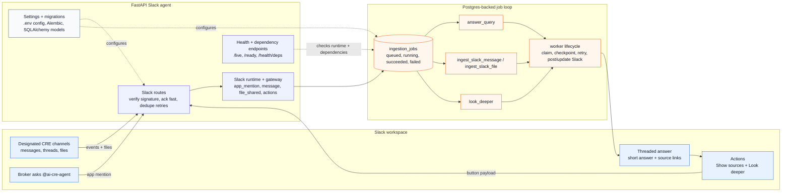
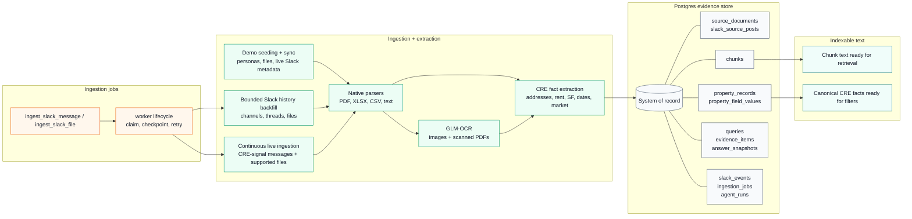
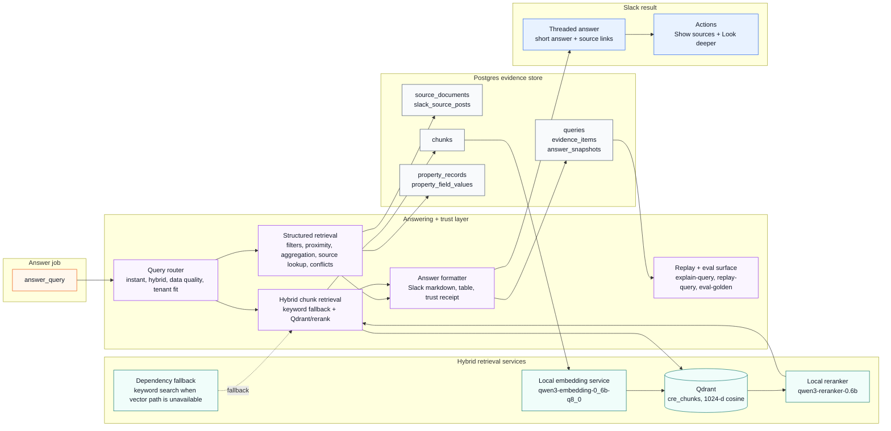
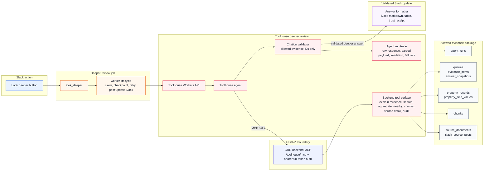
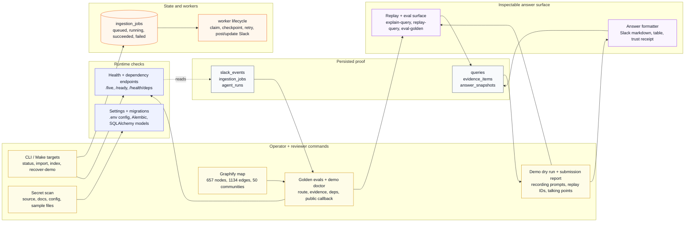
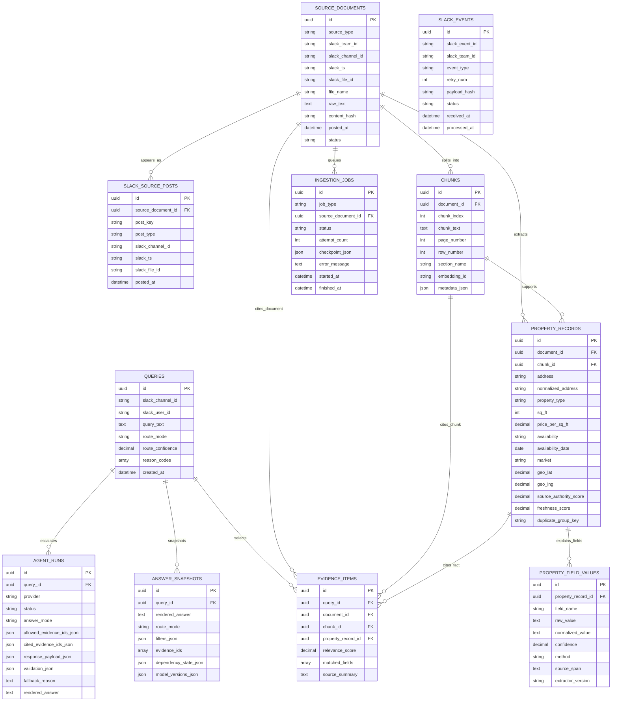
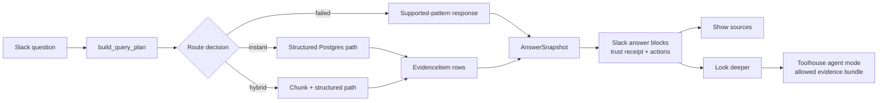

# CRE Knowledge Engine

CRE Knowledge Engine is a Slack app for commercial real estate teams. It reads the material brokers already trade in Slack - listing flyers, spreadsheets, field notes, corrections, market updates, and tenant requirements - and answers questions with the source trail attached.

The point is not to make Slack feel like a chatbot. The point is to help a broker ask, "Which properties fit?", then see the row, page, message, or correction that supports the answer. If two sources disagree, the app explains which one won and why. If the user asks for a deeper review, Toolhouse can reason over the same evidence bundle, but the backend still checks the citations before anything is posted.

## What This Demo Shows

- It answers CRE questions from Slack messages and files, and it cites where the answer came from.
- It parses PDFs, XLSX, CSV, text files, images, and scanned documents into usable property facts.
- It keeps provenance for square footage, rent, availability, market, source row or page, Slack sender, channel, and timestamp.
- It uses Postgres for exact facts: filters, proximity, aggregation, source lookup, and conflict handling.
- It uses Qdrant, local embeddings, and reranking when the question depends on source text, such as loading access or yard space.
- It gives the user two Slack actions: `Show sources` for the evidence trail, and `Look deeper` for a Toolhouse review.
- It validates Toolhouse citations against backend evidence IDs before posting a deeper answer.
- It can replay answers, run golden evals, rehearse the demo path, and generate a submission report.

Current checks:

- `uv run pytest -q` passes 81 tests with no known failures or warning noise.
- `uv run cre-cli demo-doctor --live-toolhouse` returns `ready`, including public callback health and live Toolhouse validation with no local fallback.
- `uv run cre-cli demo-dry-run --live-toolhouse` passes the recording query sequence and returns replay commands for each answer.
- `uv run cre-cli secret-scan` scans source, docs, config, and sample files with 0 findings.

## Architecture

The full system is easier to read in pieces. These five diagrams show the main loops: Slack intake, ingestion, retrieval, Toolhouse review, and the reviewer checks around the demo.

### 1. Slack Intake And Job Loop



### 2. Ingestion To Evidence Spine



### 3. Retrieval And Answering



### 4. Toolhouse Trust Boundary



### 5. Reviewer Readiness Loop



The diagrams are split on purpose. The first five show the running system without turning everything into one unreadable graph. I rebuilt Graphify before this pass and used it to make sure the README also mentions the less-visible pieces: CLI commands, health checks, settings and migrations, the worker loop, the Slack gateway, Toolhouse MCP auth, and the Graphify map itself.

The most important boundary is simple: Postgres is where the system keeps sources, facts, jobs, evidence, answer snapshots, and agent runs. Toolhouse can write a deeper explanation, but the backend decides what evidence exists and whether the returned citations are valid.

## How Data And Routing Work

The implementation follows one rule: if the app says a fact in Slack, that fact should point back to a stored source, a normalized property record, or an evidence item. The core code is in [app/models/core.py](app/models/core.py), [app/routing](app/routing), [app/retrieval](app/retrieval), [app/answering/query_service.py](app/answering/query_service.py), and [app/toolhouse](app/toolhouse).

### Database Schema



How the schema is meant to be read:

- `source_documents` is the canonical source table. It covers Slack messages, thread replies, PDFs, CSVs, XLSX files, text notes, and OCR output. Slack messages and Slack files have uniqueness rules, and repeated file content can be recognized by `content_hash`.
- `slack_source_posts` records where a source showed up in Slack. The same file can be shared twice without creating two canonical documents, but the app still keeps channel, sender, timestamp, and permalink context for each share.
- `chunks` holds the text used for search. A chunk keeps its page, row, section, embedding ID, and metadata, so a citation can say more than just "somewhere in this PDF."
- `property_records` stores facts as they appeared in a source. It does not try to merge everything into one perfect property entity too early. Likely duplicates are grouped with `duplicate_group_key` and resolved when an answer is built.
- `property_field_values` keeps the field-level audit trail: raw value, normalized value, confidence, method, source span, and extractor version.
- `queries`, `evidence_items`, and `answer_snapshots` are the answer trail. `Show sources`, `explain-query`, `replay-query`, and Toolhouse escalation all read from that trail.
- `agent_runs` stores the deeper-review trace: allowed evidence IDs, cited evidence IDs, parsed response, validation result, fallback reason, raw response, and final rendered answer.
- `slack_events` and `ingestion_jobs` keep Slack fast. The app acknowledges Slack quickly, records retries, and then lets parsing, indexing, answering, and deeper review run through a Postgres-backed queue.

### How Routing Works



The router is small by design. For each question it writes down the route, query type, confidence, reason codes, and filters it used. A few golden paths cover the most important demo questions. The generic query constructor handles the broader cases: property type aliases, known addresses, markets, uploader names, keywords, price and size thresholds, availability windows, aggregation, sorting, limits, missing-data terms, and tenant-fit wording.

| Query class | Route | What happens |
| --- | --- | --- |
| Proximity | `instant` | Recognizes seeded anchors like `123 Main Street`, computes Haversine distance from stored coordinates, sorts nearest available properties, and cites the supporting source rows. |
| Numeric filters | `instant` | Turns prompts like office under `$50/SF` into SQL predicates over `property_type` and `price_per_sq_ft`. |
| Aggregation | `instant` | Resolves source/uploader references such as John's industrial files, dedupes by `duplicate_group_key`, and sums `sq_ft` in Postgres. |
| Exact/source lookup | `instant` | Matches normalized address plus field value, then returns the source rows/pages where the value appeared. |
| Conflict review | `hybrid` | Uses a duplicate group such as Harbor Rd, orders candidates by source authority, freshness, and posting time, then labels evidence as selected, supporting, or superseded. |
| Loading or yard language | `hybrid` | Searches chunk text for expanded terms like loading dock, shared yard, trailer storage, and yard access; Qdrant/rerank is used when available, keyword fallback otherwise. |
| Generic structured search | `instant` | Builds a transparent query constructor with conditions, sort, and limit, then returns deduped structured matches. |
| Tenant fit | `hybrid` | Runs a local heuristic over price, size, availability, source quality, and logistics terms, then invites `Look deeper` for Toolhouse review. |
| Data quality | `instant` | Scans indexed sources and property rows for missing fields, sources without chunks/properties, and duplicate groups with conflicting numeric facts. |
| Unsupported | `failed` | Refuses to guess and returns the supported query patterns currently covered. |

One important detail: `hybrid` does not mean the agent is improvising. It still means backend retrieval. The answer service finds the evidence, writes the evidence rows, records dependency state, and only then posts to Slack.

### Scoring And Ranking

The ranking rules are meant to be easy to audit:

- Structured matches score field coverage plus source quality: matched-field count, `source_authority_score`, `freshness_score`, and extraction confidence. Dedupe keeps the strongest row per `duplicate_group_key`.
- Sort requests are explicit: cheapest sorts by `price_per_sq_ft`, largest by `sq_ft`, and soonest availability by `availability_date`.
- Generic structured searches return the top deduped records after filters and sort. Exact lookups can keep multiple rows so source agreement or conflict is visible.
- Loading-access keyword fallback scores term hits plus authority and freshness. A listing that says both `loading dock` and `yard` outranks one that only says one term, all else equal.
- Vector retrieval combines Qdrant and rerank scores as `0.35 * vector_score + 0.65 * rerank_score` when rerank is available; otherwise it uses the clamped vector score.
- Tenant-fit local scoring uses source quality, near-term availability, price under `$35/SF`, scale above `15,000 SF`, and logistics terms such as loading dock, yard, and trailer storage.

### Missing Values, Conflicts, And No Results

Missing data is handled directly instead of being hidden behind a confident answer.

- Missing fields stay missing. Renderers say `unknown SF`, `unknown price`, or `availability unknown`; they do not infer values from similar listings.
- Data-quality questions route to a database report over critical fields: address, property type, square footage, rent, availability, market, coordinates, and source URL.
- Sources with chunks but no property rows are reported as context-only evidence. They can support source-text search, but they do not become structured facts until extraction produces provenance.
- No-result structured queries call a relaxed matcher that removes numeric/date blockers and returns closest sourced rows when useful. The answer says which filters were applied and never fabricates a listing.
- Conflicting duplicate groups are answerable. Harbor Rd, for example, can explain why the fresher 62,000 SF correction outranks an older 58,000 SF inventory row while still citing the superseded source.
- Field-level provenance lives in `property_field_values`, so a final answer can show not only the normalized value but also the raw value, method, confidence, source span, and extractor version.

### Hybrid Search And Vector Fallbacks

Hybrid search is conservative. Qdrant helps find fuzzy source text, but Postgres still owns the source, property record, citation, and saved answer.

1. Chunk indexing embeds `chunks.chunk_text` with `qwen3-embedding-0_6b-q8_0` and upserts Qdrant points with document ID, source type, file name, Slack channel, posted date, property types, addresses, markets, and text preview.
2. Hybrid queries embed the query, retrieve Qdrant candidates, join chunk IDs back to Postgres, optionally filter by property type, and rerank with `qwen3-reranker-0.6b`.
3. If rerank succeeds, the combined score is `0.35 * vector_score + 0.65 * rerank_score`. If rerank fails, vector score is still usable. If Qdrant or embeddings are unavailable, the path returns no vector matches and the caller falls back.
4. Loading-access search still requires concrete expanded-term hits in the chunk text. A semantic match without the expected source language does not become evidence.
5. Final hybrid evidence is deduped by `duplicate_group_key`, scored with relevance, authority, and freshness, then persisted exactly like structured evidence.
6. `dependency_state_json` records whether the answer used Qdrant, rerank, keyword fallback, local scoring, or disabled dependencies, so replay can explain why the answer looked the way it did.

That means exact structured answers still work when Qdrant is down. When the vector stack is available, source-text questions get better results, but they still have to resolve back to stored Postgres evidence.

### Instant Answers And Agent Mode

Most Slack answers use the `instant_answer` path, even when the route mode is `hybrid`. The flow is predictable: route the question, retrieve evidence, render the answer, save the evidence, save the snapshot, and post the Slack reply with actions.

Agent mode starts only when the user clicks `Look deeper` or an operator runs the deeper-review path. The payload comes from `explain-query`: original question, local answer, route mode, reason codes, filters, allowed evidence IDs, evidence bundle, field details, and decision summary.

Toolhouse can synthesize over that bundle, but it cannot expand the evidence set on its own. The backend expects a structured response with status, rendered answer, cited evidence IDs, confidence label, reasoning summary, tools used, unsupported claims dropped, missing data, and suggested follow-ups. The citation validator rejects unknown evidence IDs and unsupported tool names before the answer reaches Slack.

So the modes stay separate:

- `instant_answer`: fast, local, replayable, and good for filters, aggregations, proximity, exact lookup, conflict explanation, and data quality.
- `hybrid` route mode: still local, but it can use chunk search, vector/rerank, and source-text evidence.
- `agent_mode`: Toolhouse-backed deeper review over an allowed evidence package, saved in `agent_runs`, with backend citation validation and local fallback behavior.

### Design Choices Worth Calling Out

- Postgres does two jobs: it stores the evidence and runs the queue. That keeps the demo simple while still giving idempotency, retries, checkpoints, and replay.
- Slack appearances are separate from canonical documents. If someone shares the same file again, the app keeps the new Slack context without duplicating the facts.
- The app does not pretend it has a perfect master property table. It groups likely duplicates when answering, which makes conflicts easier to explain.
- LLM and Toolhouse work happen after retrieval. They can explain and compare evidence, but they cannot create trusted facts or bypass allowed evidence IDs.
- Missing data is visible. Data-quality answers and no-result explanations tell the reviewer what the system does not know.
- Degraded dependencies are visible too. Qdrant, rerank, OCR, Toolhouse, and local fallback states are recorded in health checks and answer snapshots.
- The reviewer tools are part of the system, not extras: golden evals, replay, demo doctor, dry run, secret scan, submission report, and Graphify map all check that the app behaves the way this README says it does.

## The Slack Experience

A broker can ask:

| Slack prompt | What the agent demonstrates |
| --- | --- |
| `What properties do we have available near 123 Main Street?` | Proximity search over normalized property records with sourced nearby results. |
| `Show office buildings under $50/sq ft.` | Exact structured filtering that excludes higher-priced office inventory. |
| `Find listings that mention loading access or yard space.` | Hybrid retrieval over source text and field notes, with keyword fallback and Qdrant/rerank support. |
| `Why did you use 62k sq ft for Harbor Rd?` | Freshness and authority conflict handling with selected, supporting, and superseded evidence. |
| `Look deeper` | Toolhouse review over the allowed evidence bundle, with backend citation validation. |

Every factual answer includes a small trust receipt: which route was used, how many evidence items were checked, and why those sources were selected. `Show sources` opens the evidence trail. `replay-query` rebuilds the stored answer outside Slack.

## Why It Is Credible

CRE data is full of small contradictions that matter. One spreadsheet says 58,000 SF. A later correction says 62,000 SF. A Slack thread explains why the newer value should win. This project treats that trail as the product.

The implementation favors plain reliability where facts matter:

- Slack is acknowledged quickly; slow parsing, indexing, answering, and Toolhouse calls run through background jobs.
- Live ingestion is conservative so generic chatter is not treated as evidence.
- Source appearances are stored separately from canonical documents, so repeated Slack shares keep provenance without duplicating facts.
- Golden evals verify routes, expected addresses, source labels, reason codes, evidence order, and dependency state.
- Agent runs persist Toolhouse/local deeper-review traces, raw responses, parsed payloads, citation validation, fallback state, and rendered output.

## Try It Locally

This repo uses Python 3.12 and `uv`.

```bash
uv sync
make recover-demo
uv run cre-cli import-samples
uv run cre-cli index-chunks --reset
uv run cre-cli demo-doctor --skip-public-callback
```

Ask a local question:

```bash
uv run cre-cli ask "Show office buildings under $50/sq ft."
```

Replay the resulting answer:

```bash
uv run cre-cli replay-query <query-id>
```

Run the final readiness path:

```bash
make demo-check
make submission-report
```

For the live Slack demo, the current workstation path uses:

- FastAPI app: `http://127.0.0.1:8020`
- Public callback: `https://slack.aqwerty321.me`
- Qdrant collection: `cre_chunks`
- Embeddings: `qwen3-embedding-0_6b-q8_0`
- Rerank: `qwen3-reranker-0.6b`
- OCR: GLM-OCR at `http://127.0.0.1:5003`
- Toolhouse Agent ID: `0c2c4555-5d96-47e4-8e05-f956de7a102e`

Use `.env.example` as the non-secret template. Local `.env` values are intentionally excluded from the source secret scan.

## Reviewer Commands

```bash
uv run pytest -q
uv run cre-cli eval-golden
uv run cre-cli demo-doctor --live-toolhouse
uv run cre-cli demo-dry-run --live-toolhouse
uv run cre-cli secret-scan
uv run cre-cli submission-report --format markdown --output .runtime/submission-report.md
```

## Project Shape

- [app/main.py](app/main.py) creates the FastAPI app and worker lifecycle.
- [app/slack/](app/slack) owns Slack intake, answer rendering, source actions, and demo seeding.
- [app/ingestion/](app/ingestion) handles sample import, Slack backfill, live ingestion, source provenance, and quality checks.
- [app/extraction/](app/extraction) parses native files and routes image/scanned-document OCR.
- [app/retrieval/](app/retrieval) and [app/routing/](app/routing) implement structured, hybrid, tenant-fit, and data-quality retrieval.
- [app/answering/query_service.py](app/answering/query_service.py) writes queries, evidence items, answer snapshots, and explanation payloads.
- [app/toolhouse/](app/toolhouse) contains the Workers API client, local deeper-review fallback, MCP server, backend tools, and citation validator.
- [app/evaluation/](app/evaluation) provides golden evals, replay, demo doctor, demo dry run, secret scan, and submission report generation.
- [tests/](tests) covers golden answers, Slack loop behavior, ingestion, parsers, Toolhouse tools/client/MCP, and readiness commands.

## Submission Notes

- Demo video script: [docs/slack-demo-video-script.md](docs/slack-demo-video-script.md)
- Demo runbook: [docs/slack-demo-runbook.md](docs/slack-demo-runbook.md)
- Sample data and evaluation plan: [docs/sample-data-and-evaluation.md](docs/sample-data-and-evaluation.md)
- Production practices and trade-offs: [docs/production-practices.md](docs/production-practices.md)
- Toolhouse readiness checkpoint: [docs/toolhouse-readiness-checkpoint.md](docs/toolhouse-readiness-checkpoint.md)
- Generated submission report: [.runtime/submission-report.md](.runtime/submission-report.md)

Hardest part: keeping Slack ingestion, document parsing, retrieval, citations, Slack actions, and Toolhouse review tied to the same evidence IDs.

Main trade-off: I used a saved evidence trail and Postgres-backed jobs instead of adding orchestration frameworks for show. That is less flashy internally, but it is easier to defend in a CRE workflow where exact rent, square footage, availability, and source provenance matter.

With two more weeks: add production OAuth and multi-workspace permissions, an admin review UI for low-confidence extraction, object storage for files, telemetry dashboards, external geocoding and drive-time search, retrieval benchmark snapshots, and retention/deletion workflows for Slack-originated data.