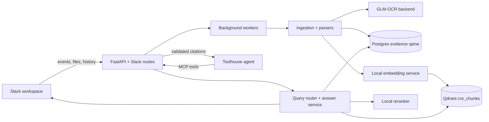

# CRE Knowledge Engine

A runnable Slack-native Commercial Real Estate knowledge agent backend. It ingests Slack messages and files, parses native documents and OCR images, normalizes property facts with provenance, retrieves grounded evidence, answers Slack questions with citations, and escalates bounded synthesis to Toolhouse when the instant path needs deeper review.

## Current Validation

- Full regression suite: `uv run pytest -q` passes 81 tests with no known failures or warning noise.
- Demo preflight: `uv run cre-cli demo-doctor --live-toolhouse` returns `ready`, including golden evals, public callback health, and live Toolhouse validation with no local fallback.
- Public dependency health: `https://slack.aqwerty321.me/health/deps` reports database, Qdrant, embeddings, rerank, OCR, Slack, Toolhouse, Toolhouse agent, Toolhouse MCP, and background worker configured/healthy.
- Live Toolhouse smoke: `uv run cre-cli toolhouse-smoke "Find listings that mention loading access or yard space."` completed through Toolhouse with no local fallback and valid evidence citations.
- Live Slack history sync: `uv run cre-cli sync-slack-history --recent-limit 100 --reindex` scanned 4 configured channels, 32 messages, 4 thread replies, ingested 0 new sources under the current per-channel policies, and preserved the clean 14-source / 14-chunk corpus.
- OCR smoke: `uv run cre-cli ocr-smoke <image> --source-type image` parsed a real GLM-OCR sample image through the app parser path using `glm_ocr`.
- Qdrant collection: `cre_chunks`, 14 indexed points, 1024-dimensional cosine vectors.

## What It Does

- Accepts Slack events quickly, deduplicates retries, and queues background answer or ingestion work only for CRE-signal messages and supported file types, with per-channel ingest policy overrides.
- Imports CRE source files from the sample manifest and live Slack uploads/messages.
- Parses PDF, XLSX, CSV, text, images, and scanned PDFs; images/scanned PDFs can use the local GLM-OCR backend.
- Extracts structured property records with field-level provenance and conservative live-message heuristics.
- Stores source documents, Slack source-post provenance, chunks, property records, field values, queries, evidence, answer snapshots, agent runs, Slack events, and ingestion jobs in Postgres.
- Answers deterministic structured questions directly from Postgres when facts are clear.
- Uses Qdrant plus local embeddings/reranking for hybrid chunk retrieval when evidence text matters.
- Posts Slack answers with sourced evidence and supports a bounded Toolhouse `Look deeper` path that validates cited evidence IDs before returning to Slack.

## Architecture



Core principle: structured facts win when they are available; hybrid retrieval supports source-text questions; Toolhouse is reserved for bounded synthesis and must cite evidence already allowed by the backend.

## Local Services

The full demo path expects these local services:

| Service | Default endpoint | Purpose |
| --- | --- | --- |
| FastAPI app | `http://127.0.0.1:8020` | Slack routes, health, Toolhouse MCP |
| Public tunnel | `https://slack.aqwerty321.me` | Slack and Toolhouse callback surface |
| Postgres | `postgresql+asyncpg://...` | Structured facts, evidence, jobs |
| Qdrant | `http://localhost:6333` | Vector chunk index, collection `cre_chunks` |
| Embeddings | `http://127.0.0.1:8001/v1/embeddings` | `qwen3-embedding-0_6b-q8_0`, 1024 dims |
| Rerank | `http://127.0.0.1:8002/v1/rerank` | `qwen3-reranker-0.6b` |
| GLM-OCR | `http://127.0.0.1:5003` | Image and scanned-document OCR |

Start Qdrant locally when needed:

```bash
docker compose up -d qdrant
```

The current `.env` on this workstation enables vector search, vector indexing on import, Slack ingestion channels, Toolhouse credentials, and OCR. Use `.env.example` as the non-secret template.

Slack ingest policy and retention controls:

- `CRE_SLACK_INGEST_CHANNEL_POLICIES_RAW` supports `channel_id=policy` entries separated by commas.
- Supported policies are `evidence`, `files_only`, `listings_only`, and `disabled`.
- `CRE_SLACK_CONTEXT_RETENTION_DAYS` prunes old live Slack message context with no structured property rows.
- `CRE_SLACK_DOWNLOAD_RETENTION_DAYS` releases old downloaded Slack files from disk after parsing/indexing.
- `CRE_SLACK_STORAGE_PRUNE_INTERVAL_SECONDS` controls automatic background pruning cadence; set `0` to disable the periodic worker-side prune.

## Runbook

Install and validate:

```bash
uv sync
uv run pytest -q
uv run cre-cli status
```

Recover the local demo stack after a reboot:

```bash
make recover-demo
```

That recovery path starts Postgres and Qdrant via Docker, restores the FastAPI app on `8020`, starts GLM-OCR from its own backend directory so it reads the correct `.env`, and reconnects the named `cloudflared` tunnel when the public callback URL is down. Local logs and pid files are written under `.runtime/`.

Import local samples and build the vector index:

```bash
uv run cre-cli import-samples
uv run cre-cli index-chunks --reset
uv run cre-cli audit-data
```

Run the API locally:

```bash
uv run uvicorn app.main:app --host 0.0.0.0 --port 8020 --reload --no-access-log
```

Run the reviewer-facing eval and preflight surface:

```bash
uv run cre-cli eval-golden
uv run cre-cli demo-doctor --skip-public-callback
uv run cre-cli demo-dry-run --skip-public-callback
uv run cre-cli secret-scan
uv run cre-cli submission-report --skip-public-callback --format markdown --output .runtime/submission-report.md
uv run cre-cli replay-query <query-id>
```

`eval-golden` reruns built-in golden questions and validates route mode, expected addresses, source labels, reason codes, snapshot evidence ID ordering, and dependency state. `demo-doctor` combines corpus counts, local dependency health, ingestion audit readiness, golden evals, and Toolhouse config into one preflight result. `demo-dry-run` executes the recording prompt sequence and returns query IDs plus replay commands. `secret-scan` checks source/docs/config/sample files while excluding local env/runtime artifacts. `submission-report` packages readiness checks, dry-run steps, deliverables, and follow-up talking points into a final report. `replay-query` prints the stored answer snapshot, evidence bundle, model/dependency state, replay checks, and any saved agent-run traces for a query.

Exercise live Slack ingestion and reindexing:

```bash
uv run cre-cli sync-slack-history --recent-limit 100 --reindex
uv run cre-cli prune-slack-storage --reindex
```

Smoke OCR through the parser path:

```bash
uv run cre-cli ocr-smoke /path/to/image.png --source-type image
```

Smoke the live Toolhouse path:

```bash
uv run cre-cli toolhouse-smoke "Find listings that mention loading access or yard space."
```

## Golden Queries

| Query | Expected behavior |
| --- | --- |
| `Show office listings under $40/SF.` | Structured Postgres answer with office listings and citations. |
| `Find listings that mention loading access or yard space.` | Hybrid Qdrant/rerank retrieval; latest smoke returns `130 Elm Ave` and `64 Union Yard` only. |
| `What changed for Harbor Rd?` | Hybrid conflict explanation showing current, supporting, and superseded evidence. |
| `Why is Harbor listed as 62k SF?` | Explains the selected source-of-truth correction and cites evidence. |
| `Which properties fit John's industrial requirement?` | Tenant-fit synthesis over structured fields with missing-data notes where needed. |
| `Look deeper` from Slack | Toolhouse bounded review using backend evidence tools and validated citation IDs. |

## Important Trust Boundaries

- Slack events are acknowledged quickly and processed by background jobs.
- Slack retries are deduplicated by team and event ID.
- Source chunks, property fields, and Slack source-post rows retain provenance back to Slack messages/files or sample documents, including repeated file shares across channels.
- Golden eval and replay commands validate that answer snapshot evidence IDs still resolve to the exact stored evidence order shown to the user.
- Live Slack ingestion is intentionally conservative: generic channel chatter is ignored, unsupported file types are skipped, address-only chatter does not become a structured property record, and per-channel policy can force `files_only`, `listings_only`, or `disabled` ingestion.
- Toolhouse cannot invent citations; returned evidence IDs are validated against the backend allowlist before Slack posting.
- Vector search is optional and has keyword fallback, but the demo environment currently has Qdrant, embeddings, and rerank healthy.

## Project Map

- [app/main.py](app/main.py) - FastAPI app creation and background worker lifecycle.
- [app/api/routes/slack.py](app/api/routes/slack.py) - Slack event and interactivity endpoints.
- [app/slack/service.py](app/slack/service.py) - Slack answer rendering and source actions.
- [app/ingestion/sample_importer.py](app/ingestion/sample_importer.py) - Manifest/live-source import, structured extraction, and indexing hooks.
- [app/ingestion/slack_ingestor.py](app/ingestion/slack_ingestor.py) - Live Slack message/file ingestion and bounded history backfill.
- [app/extraction/parsers.py](app/extraction/parsers.py) - Native parsers and OCR routing.
- [app/indexing/vector_service.py](app/indexing/vector_service.py) - Embedding, Qdrant indexing/search, and rerank integration.
- [app/answering/query_service.py](app/answering/query_service.py) - Query routing, evidence selection, answers, and explanations.
- [app/evaluation/golden.py](app/evaluation/golden.py) - Golden evals, query replay payloads, and demo-doctor checks.
- [app/evaluation/submission.py](app/evaluation/submission.py) - Secret scanning and final submission report generation.
- [app/toolhouse/tools.py](app/toolhouse/tools.py) - Backend tools exposed to Toolhouse/MCP.
- [tests/](tests/) - Golden, Slack, Toolhouse, parser, and CLI coverage.

## Deeper Docs

- [problem-statement/Take Home Assigment.txt](problem-statement/Take%20Home%20Assigment.txt) - original assignment text.
- [docs/assignment-brief.md](docs/assignment-brief.md) - cleaned brief, acceptance criteria, and constraints.
- [docs/final-implementation-spec.md](docs/final-implementation-spec.md) - implementation architecture and MVP scope.
- [docs/slack-toolhouse-integration.md](docs/slack-toolhouse-integration.md) - Slack, Toolhouse, event, file, and backfill plan.
- [docs/cre-data-dictionary.md](docs/cre-data-dictionary.md) - canonical schema, normalization, and provenance model.
- [docs/retrieval-routing-spec.md](docs/retrieval-routing-spec.md) - query routing, retrieval, ranking, and citation behavior.
- [docs/sample-data-and-evaluation.md](docs/sample-data-and-evaluation.md) - sample data manifest, golden queries, and demo checks.
- [docs/production-practices.md](docs/production-practices.md) - production-quality guardrails, trust invariants, operator runbooks, and demo checklist.
- [docs/toolhouse-readiness-checkpoint.md](docs/toolhouse-readiness-checkpoint.md) - readiness state, query-constructor behavior, local `Look deeper`, and Toolhouse handoff plan.
