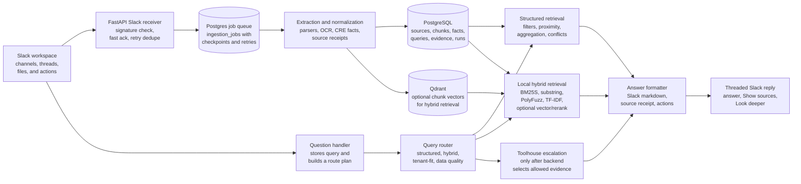

# Final Implementation Spec

## Product Definition

CRE Knowledge Engine is a Slack-native retrieval system for commercial real estate teams. It turns Slack messages and shared files into source-grounded property knowledge and answers questions in Slack.

The system is not a generic chatbot. It is a retrieval-native intelligence layer with a Slack surface.

## Architecture Overview



## Service Boundary

### Backend

Owns:

- Slack event acknowledgement;
- historical backfill;
- file download coordination;
- parsing and extraction;
- normalized CRE records;
- semantic chunks;
- query routing;
- deterministic filters and aggregation;
- citation assembly;
- answer logs and replay.

### Toolhouse

Owns:

- the deeper agentic path;
- orchestration when a query is vague or synthesis-heavy;
- optional Slack worker behavior;
- calls to backend retrieval tools;
- broader summaries and recommendations over grounded evidence.

Toolhouse should call backend tools instead of directly inventing property facts.

## Architecture Locks And Ambitious MVP

The architecture council review in [architecture-council-review.md](architecture-council-review.md) tightened the MVP around a deterministic evidence spine. The scope rebalance in [ambitious-scope-council-review.md](ambitious-scope-council-review.md) expands what should be included once that spine is passing locally.

Locked decisions for implementation:

- PostgreSQL is the source of truth for sources, facts, chunks metadata, evidence, queries, and jobs.
- Local sample import must be built before full live Slack backfill.
- The importer and Slack backfill must write the same source, fact, chunk, and evidence tables.
- A PostgreSQL-backed `ingestion_jobs` table plus a worker loop is the first queue implementation.
- Qdrant is part of the full demo path for hybrid retrieval, but exact lookup, filters, aggregation, proximity, and citations must work without it.
- Toolhouse is required for a visible `Look deeper` synthesis flow and should receive a useful backend tool surface, but it must not own primary fact storage or deterministic answers.
- LLM extraction, if used, must be schema-bound, source-backed, confidence-scored, and barred from arithmetic.

Implementation should follow the P0/P1/P2 priorities, trust invariants, fallback contract, and operator runbooks in [production-practices.md](production-practices.md).

Ambitious MVP additions:

- bounded live Slack backfill for one to three configured channels;
- continuous ingestion for new messages and files;
- Qdrant-backed semantic retrieval for at least one golden hybrid query;
- source authority and freshness scoring;
- duplicate grouping at answer time;
- executable golden query tests;
- polished Slack actions for `Show sources` and `Look deeper`;
- bounded LLM extraction fallback for missed PDF/text fields;
- lightweight ingestion/query status through logs, records, or an endpoint.

## MVP Components

### `app/slack/`

- Handles `app_mention`, selected `message` events, file events, and interactive button actions.
- Posts threaded replies.
- Updates messages for longer-running answers.
- Sends work to the queue after acknowledging Slack.

### `app/ingestion/`

- Imports local sample data through the same source-document contract as Slack backfill.
- Backfills one to three configured Slack channels with cursor checkpoints.
- Fetches thread replies separately from channel history.
- Lists and downloads visible Slack files for the configured channels.
- Records Slack event IDs for idempotency.
- Stores source document records before extraction.
- Handles new message and file events after startup through the same job contract.

### `app/workers/`

- Polls `ingestion_jobs` from PostgreSQL.
- Claims jobs with status transitions such as `queued`, `running`, `succeeded`, `failed`, and `retrying`.
- Persists cursor, page, file, and extraction checkpoints.
- Keeps Slack acknowledgement decoupled from slow parsing, indexing, and Toolhouse work.

### `app/extraction/`

- PDF: `PyMuPDF` text extraction, page-aware chunks.
- CSV: `pandas` row extraction.
- XLSX: `pandas` with `openpyxl`.
- Text and Slack messages: direct text extraction with channel, sender, and timestamp metadata.
- Bounded LLM fallback: schema-bound candidate field extraction only when deterministic extraction misses important fields; store source snippet, method, and confidence.

### `app/normalization/`

- Standardizes address, property type, square footage, rent, availability, dates, and market.
- Converts rent strings such as `$42/sf`, `$42 per sq ft`, and `42 psf` into `price_per_sq_ft`.
- Converts square-footage variants such as `4,800 SF`, `4800 rsf`, and `4.8k sq ft` into integers.
- Assigns field-level confidence and extraction method.

### `app/indexing/`

- Creates document chunks with source metadata.
- Writes embeddings to Qdrant when the semantic layer is enabled.
- Keeps chunk IDs linked back to PostgreSQL rows.
- Supports reindexing by document and by full workspace.
- Leaves structured answers operational if Qdrant is unavailable.

### `app/routing/`

- Classifies query intent.
- Chooses `instant`, `hybrid`, or `agentic` mode.
- Records route, confidence, and reason codes.

### `app/retrieval/`

- Runs structured filters and aggregations in PostgreSQL.
- Runs semantic chunk retrieval in Qdrant.
- Applies metadata filters and simple reranking.
- Builds evidence lists with provenance.
- Applies lightweight source authority and freshness scoring.
- Groups likely duplicate property mentions at answer time without full entity resolution.

### `app/answering/`

- Produces concise Slack messages.
- Formats tables or short lists when helpful.
- Includes source citations.
- Avoids exposing hidden reasoning or internal traces.

### `app/toolhouse/`

- Exposes backend tools to the Toolhouse agent.
- Packages query context, initial retrieval, and evidence for escalation.
- Receives agent synthesis and formats it through the same citation layer.

## Backend Tools For Toolhouse

Expose a small, boring, reliable tool surface:

| Tool | Purpose |
| --- | --- |
| `search_properties` | Filter property records by address, type, rent, square footage, availability, date, and source. |
| `aggregate_properties` | Compute sums, counts, averages, and grouped totals from structured facts. |
| `search_source_chunks` | Semantic or keyword search over source chunks with metadata filters. |
| `get_source_detail` | Return a source document, page, row, message, permalink, and snippet. |
| `nearby_properties` | Return records near a known address or coordinate using seeded sample coordinates. |
| `explain_evidence` | Return the evidence bundle used by a prior answer. |

MVP order:

1. `search_properties`;
2. `aggregate_properties`;
3. `search_source_chunks`;
4. `get_source_detail`;
5. `nearby_properties`;
6. `explain_evidence`.

The visible Toolhouse demo can still center on one `Look deeper` path, but the richer backend tool surface makes the agent feel genuinely connected to the knowledge engine.

## Query Modes

### Instant

Use when the query maps cleanly to structured facts:

- exact address lookup;
- property type filter;
- rent or square-foot threshold;
- sum, count, average, min, max;
- source lookup by uploader, file, or date;
- proximity over seeded coordinates.

### Hybrid

Use when the query contains both structure and language:

- fuzzy area terms;
- partial addresses;
- document summaries with filters;
- comparison across several files;
- questions where semantic context helps select evidence.

### Agentic

Use when the query needs synthesis or judgment:

- best-fit recommendation;
- market interpretation;
- ambiguous terms such as `good deal` or `best option`;
- broad summary across multiple documents;
- user clicks `Look deeper`.

## Citation Format

Slack answers should cite sources compactly:

```text
120 Main St - Class A office, 4,800 sq ft, $42/sq ft, available Q3 2026.
Source: Main Street Office Flyer.pdf, p. 1, posted by Sarah in #listings on May 14.
```

For tables, include a source column or a short source line after the result list.

## Data Flow

### Backfill

0. Import local sample files and Slack-shaped message metadata into the same source tables used by Slack backfill.
1. List configured Slack channels.
2. Fetch channel history with cursors and time windows.
3. Store each message as a source document or source event.
4. For thread roots with replies, fetch thread replies separately.
5. List files by channel and time range.
6. Download visible files and store metadata.
7. Enqueue extraction jobs.
8. Save checkpoints so backfill can resume.

### Continuous Ingestion

1. Receive Slack event.
2. Verify signature and dedupe by event ID.
3. Acknowledge quickly.
4. Enqueue message or file processing.
5. Parse and normalize content.
6. Update structured records and semantic index.

### Query Answering

1. Receive mention or command.
2. Parse user query and active Slack context.
3. Route to instant, hybrid, or agentic path.
4. Retrieve evidence.
5. Format answer and citations.
6. Post threaded reply with `Show sources` and optional `Look deeper` action.

## MVP Technology Choices

| Concern | Choice | Reason |
| --- | --- | --- |
| Language | Python | Strong Slack, parsing, data, and ML ecosystem. |
| API | FastAPI | Simple webhooks, health checks, and tool endpoints. |
| Slack | Slack Bolt for Python | Handles events, actions, and Slack response patterns. |
| Structured store | PostgreSQL | Provenance, filters, aggregation, and replay. |
| Vector store | Qdrant | Useful for hybrid retrieval; exact structured answers must not depend on it. |
| PDF parsing | PyMuPDF | Fast page-aware extraction. |
| CSV/XLSX | pandas plus openpyxl | Reliable tabular parsing. |
| Local deploy | Docker Compose | Reproducible and lightweight for a take-home. |
| Queue | PostgreSQL jobs first | Durable enough for the MVP with fewer services than Redis/Celery. |
| LLM extraction fallback | Schema-bound recovery path | Recovers missed fields without letting the model own facts or arithmetic. |

## What To Build First

1. Database schema, repositories, and PostgreSQL-backed jobs.
2. Local sample importer that writes Slack-shaped source metadata.
3. File parsers and property extraction rules.
4. Structured query engine for exact lookup, filters, aggregation, and seeded proximity.
5. Citation formatter and golden query loop.
6. Golden query test harness.
7. Slack mention handler with sourced answers and `Show sources`.
8. Backfill command for one configured Slack channel plus new message/file ingestion.
9. Qdrant chunk indexing and one hybrid retrieval query.
10. Toolhouse `Look deeper` escalation path with backend tools.
11. Bounded LLM extraction fallback.
12. README and demo script.

## Quality Bar

- No answer without evidence.
- No arithmetic from an LLM.
- No source citation without stored provenance.
- No long-running Slack event processing before acknowledgement.
- No agentic path that can bypass citations.
- No hidden dependency on a single perfect sample file.
- No dependency on Qdrant for structured golden queries.
- No live Slack dependency for local golden-query verification.
