# Gmail CRE Demo — Existing Stack vs My Build

> CTO briefing: what the repository already gives us, and exactly what I will implement next.

Shareable exports: [PNG](assets/gmail-rag-orlie-execution.png) · [SVG](assets/gmail-rag-orlie-execution.svg)

```mermaid
flowchart TB
    O0["0. 30 PROPERTY DATA — REUSE NOW<br/><br/><b>What already works</b> — deterministic generator plus 2,425 seeded CRE rows with suite, size, rent, dates, power, HVAC, parking, and location.<br/><br/><b>What I will build</b> — curate 30 Austin scenario properties and freeze expected winners, near matches, and exclusions."]

    O1["1. GOOGLE SHEET PROPERTY LIST<br/><br/><b>What already works</b> — CSV/XLSX/PDF import into PostgreSQL with source, row/page, and field provenance.<br/><br/><b>What I built</b> — a six-tool standalone MCP returns the exact Sheet contract and automatically seeds 30 typed Austin property rows into an empty Sheet."]

    O2["2. TEN REAL GMAIL TEST MESSAGES<br/><br/><b>What already works</b> — source records, chunks, durable jobs, dedupe, file storage, and PDF/XLSX/CSV/text/OCR attachment parsers.<br/><br/><b>What I built</b> — an authenticated Gmail sender delivers eight listings, one correction, and one requirement from aadityasoni2020@gmail.com to aaditya@toolhouse.ai with a searchable subject prefix."]

    O3["3. TOOLHOUSE RUNS THE LIVE WORKFLOW<br/><br/><b>What already works</b> — Toolhouse Workers client plus MCP tools for property search, ranking, summaries, timelines, conflicts, sources, and citation validation.<br/><br/><b>What I built</b> — after every real Gmail delivery the sender starts an immediate Toolhouse Agent Run and waits for completion; the Worker reads Gmail, calls our MCP, updates Sheets, matches, and sends."]

    O4["4. EMAIL → MATCH → SENT REPLY<br/><br/><b>What already works</b> — structured/hybrid retrieval, EvidenceItem, AnswerSnapshot, source receipts, durable jobs, and Toolhouse citation validation.<br/><br/><b>What I built</b> — typed email events → FIT/NO FIT/UNKNOWN matcher → grounded reply → one Gmail send locked to the secondary test account. Prove zero duplicate sends and zero footer-address properties."]

    O0 --> O1 --> O2 --> O3 --> O4

    classDef ready fill:#dcfce7,stroke:#16a34a,stroke-width:3px,color:#111827
    classDef adapt fill:#dbeafe,stroke:#2563eb,stroke-width:3px,color:#111827
    classDef build fill:#ffedd5,stroke:#ea580c,stroke-width:3px,color:#111827

    class O0,O3 ready
    class O1 adapt
    class O2,O4 build
```



## Honest Status

- **Reusable platform underneath the pivot: approximately 55–60% present.** Storage, jobs, attachment parsing, property data, retrieval, ranking, citations, Toolhouse, and source auditing already run.
- **Standalone Gmail demo code path: approximately 85–90% ready.** The property seed, live Gmail sender, immediate Agent Run trigger, Sheet contract, validators, deterministic matcher, authorized reply payload, prompt, and runbook are implemented and covered by focused tests. The remaining work is live credential/connector setup and one end-to-end rehearsal inside Toolhouse.
- **The production Gmail RAG pivot is not 85–90% done.** Full mailbox history, MIME/forward segmentation, durable temporal claims, multi-user access, VTS, and production monitoring remain post-demo work.

These are implementation-readiness estimates, not production-readiness claims. The narrow `real Gmail → Toolhouse → Sheet → match → sent Gmail reply` loop now exists; live connector credentials are the only unverified part of that demo path.

## Exact Next Sequence

```text
Create one empty Sheet with Properties + ProcessedEmails tabs
  → connect primary Gmail + Google Sheets tools to one Toolhouse Worker
  → add our six-tool custom MCP and the exact worker prompt
  → send 10 real [CRE-DEMO] emails from the secondary account
  → trigger one immediate Toolhouse Agent Run after each delivery
  → the Worker calls our CRE MCP and updates the Sheet
  → the requirement email triggers matching
  → the Worker's Gmail tool sends one reply in the original thread
```

Toolhouse-native references: [Agent Workers and schedules](https://docs.toolhouse.ai/toolhouse/agent-workers) · [automatic MCP discovery](https://docs.toolhouse.ai/toolhouse/automatically-connect-mcp-servers) · [custom MCP integrations](https://docs.toolhouse.ai/toolhouse/custom-mcp-servers-integrations) · [Gmail and Google Sheets integrations](https://toolhouse.ai/en/).
