# Gmail CRE Assistant — Functional and Technical Attack

> The same six product stages, now showing how each stage will be built and which working parts of this repository it reuses.

Shareable exports: [PNG](assets/gmail-rag-pivot-overview.png) · [SVG](assets/gmail-rag-pivot-overview.svg)

CTO-facing build/status view: [What Is Already Built and What I Will Build Next](gmail-rag-orlie-execution.md).

```mermaid
flowchart TB
    A["1. CRE EMAIL ARRIVES IN GMAIL<br/><br/><b>Function</b> — ingest requirements, inquiries, listing replies, updates, brochures, and attachments.<br/><br/><b>Technical attack</b> — send real [CRE-DEMO] messages from the secondary account to the connected primary inbox. Each delivery starts an immediate Toolhouse Agent Run. Gmail searches the exact sender + subject prefix, reads the message/thread and attachments, and stores the Gmail message ID so repeated runs create no duplicate effects.<br/><br/><b>Already working</b> — live authenticated Gmail sender; Toolhouse Agent Run trigger; six-tool standalone MCP; FastAPI intake; durable ingestion/checkpoint patterns; PDF/XLSX/CSV/text/OCR parsers."]

    B["2. THE ASSISTANT UNDERSTANDS THE EMAIL<br/><br/><b>Function</b> — identify the email type, people, property, suites, requirement, facts, corrections, and follow-up instructions.<br/><br/><b>Technical attack</b> — recursively parse MIME; normalize HTML; split authored/forwarded/quoted/signature/disclaimer sections; run multi-label classification and typed Pydantic extraction; save every value with its exact text span.<br/><br/><b>Already working</b> — parse_source_file; CRE signal/property extraction; rich PropertyRecord fields; PropertyFieldValue provenance, confidence, authority, and freshness. Reuse the parsers/schema, replace the unsafe whole-email heuristic."]

    C["3. ORGANIZE THE KNOWLEDGE AND CHOOSE THE JOB<br/><br/><b>Function</b> — maintain tenant requirements, property knowledge, conversation context, and decide whether to match spaces, answer an inquiry, or track a change.<br/><br/><b>Technical attack</b> — add Requirement, Constraint, Claim, Match, Message, and FollowUp tables; resolve property/building/suite aliases; compile the latest-known view; extend routing for match, inquiry, change, and response intents.<br/><br/><b>Already working</b> — PostgreSQL + SQLAlchemy + Alembic; broad PropertyRecord schema; QuerySpec/query router; ThreadSession context; duplicate, freshness, authority, and conflict metadata."]

    D["4. PRODUCE BROKER-READY WORK<br/><br/><b>Function</b> — return a ranked shortlist, explain fit/gaps, answer property questions, compose the response, and attach sources.<br/><br/><b>Technical attack</b> — filter candidates in SQL; retrieve supporting text with BM25/fuzzy/Qdrant; score every need as FIT/NO FIT/UNKNOWN; render factual bullets deterministically; let Toolhouse improve wording only over selected evidence; store the sent-response snapshot.<br/><br/><b>Already working</b> — structured_service; BM25S + PolyFuzz + TF-IDF + optional Qdrant/reranker; query_service; EvidenceItem + AnswerSnapshot; source receipts; comparison CSV; Toolhouse/MCP search, rank, timeline, conflict, and audit tools."]

    E["5. TOOLHOUSE SENDS THE GMAIL REPLY<br/><br/><b>Function</b> — send the generated reply in the original Gmail thread, record the outbound message, and schedule follow-up.<br/><br/><b>Technical attack</b> — the same Toolhouse Worker verifies the recipient, thread, subject prefix, and absence of an existing sent reply, then uses Gmail to send once. The demo backend rejects every recipient except the secondary test account. Later expose VTS and reminder actions as additional Toolhouse/MCP tools.<br/><br/><b>Already working</b> — EvidenceItem, AnswerSnapshot, source receipts, background jobs, Toolhouse runs, and AgentRun audit records. Gmail, Sheets, and custom MCP tools are orchestrated by the Worker."]

    F["6. NEW REPLIES IMPROVE THE PICTURE<br/><br/><b>Function</b> — absorb later replies, corrections, availability changes, and completed follow-ups so the next answer uses current information.<br/><br/><b>Technical attack</b> — the scheduled Toolhouse Worker uses its Gmail tool to find later replies and calls the same CRE ingestion MCP tool. Add new time-stamped claims, supersede rather than overwrite, refresh current views/search indexes, and update requirement/reminder state.<br/><br/><b>Already working</b> — continuous ingestion/backfill patterns; event dedupe; job checkpoints/retries; conversation history; freshness and authority scores; conflict/timeline tools; Qdrant reindexing. Add Toolhouse run checkpoints and temporal claim resolution."]

    A --> B --> C --> D --> E --> F
    F -. next email or correction .-> A

    classDef input fill:#e8f2ff,stroke:#2563eb,color:#111827
    classDef understand fill:#eef2ff,stroke:#4f46e5,color:#111827
    classDef knowledge fill:#ecfdf5,stroke:#059669,color:#111827
    classDef work fill:#fff7ed,stroke:#ea580c,color:#111827
    classDef review fill:#fdf4ff,stroke:#a21caf,color:#111827

    class A,F input
    class B understand
    class C knowledge
    class D work
    class E review
```

The implementation sequence is deliberately concrete: connect primary Gmail and Google Sheets to one Toolhouse Worker → add our custom MCP → send 10 real Gmail messages from the secondary account → trigger an immediate Agent Run after each delivery → call our validation/matching tools → update the Sheet → send one Gmail reply to the secondary account.

Toolhouse-native references: [Agent Workers and schedules](https://docs.toolhouse.ai/toolhouse/agent-workers) · [automatic MCP discovery](https://docs.toolhouse.ai/toolhouse/automatically-connect-mcp-servers) · [custom MCP integrations](https://docs.toolhouse.ai/toolhouse/custom-mcp-servers-integrations) · [Toolhouse Gmail and Google Sheets integrations](https://toolhouse.ai/en/).

For the full schema, phase gates, and backlog, see the [pivot roadmap](gmail-rag-pivot-roadmap.md).
