# Gmail-First CRE Knowledge Engine Pivot Roadmap

> Status: decision-ready implementation plan; Gmail and VTS runtime work has not started.
>
> As of: August 14, 2026.
>
> Current baseline: the checked-in Slack-native application remains the working reference implementation. This document defines an additive pivot, not a claim that the pivot is already built.

Broad visual summary: [Gmail-First CRE Knowledge Engine — Broad Overview](gmail-rag-pivot-overview.md).

Execution/status summary: [Orlie’s Demo Plan — Mapped to What Is Already Working](gmail-rag-orlie-execution.md).

Council pressure-test: [Gmail RAG Pivot Council Review](gmail-rag-pivot-council-review.md).

## Executive Decision

Pivot the product from a Slack-centric property search bot to a Gmail-first CRE workflow engine:

```text
email
  -> Toolhouse Worker with connected Gmail and Google Sheets tools
  -> custom CRE MCP tools from this repository
  -> immutable source and conversation record
  -> authored / forwarded / quoted / signature segmentation
  -> requirement, inquiry, listing, correction, and follow-up events
  -> temporal, source-backed claims
  -> current property and requirement views
  -> deterministic requirement-to-space matching
  -> evidence-grounded response draft
  -> human approval
  -> Gmail draft reply for broker review
  -> optional follow-up task and VTS action
```

This is not “put every email into a vector database and chat with it.” CRE email is an operational event stream in which availability, rent, suite configuration, timing, and deal status change. The durable truth must therefore be an append-only claim ledger with source spans, authority, qualification, and time. Vector search remains an accelerator for finding narrative evidence; it is not the database of record.

The existing application should evolve rather than be replaced. Retain PostgreSQL, Alembic, parsing, jobs, evidence items, answer snapshots, hybrid retrieval, replay, evaluation, and the Toolhouse citation boundary. Configure one Toolhouse Worker with Gmail and Google Sheets tools, expose the CRE engine through custom MCP tools, and add provider-neutral scopes, email segmentation, requirement and claim models, deterministic matching, and draft artifacts. Do not build a second orchestration layer or a separate Gmail adapter for the demo.

## Working Assumptions

Unless the product owner changes them, the first pilot assumes:

- one explicitly consented Google Workspace mailbox;
- a bounded 12-month backfill, configurable up to 24 months after quota, retention, and policy review;
- read-only Gmail access during ingestion and matching;
- no automatic email sending;
- no automatic VTS mutation;
- sanitized fixtures, not customer mail, in git;
- PostgreSQL as the source of truth;
- Qdrant as a rebuildable, scoped retrieval index;
- Gmail drafts are the pilot review surface; the legacy Slack application is outside the Gmail product and demo path;
- Toolhouse is the worker, schedule, connected-app, and orchestration layer; the backend remains authoritative for CRE facts, matching, and evidence validation;
- Google Sheets, if used, only as an export or review view.

Any move from one mailbox to shared/team knowledge is a separate authorization and isolation milestone, not a configuration toggle.

## Product Promise

For a broker or leasing team, the system should:

1. detect a new requirement, inquiry, listing response, availability change, correction, or follow-up instruction;
2. learn structured property and suite facts from prior, authorized email and attachments;
3. match a requirement against the portfolio without treating unknown facts as satisfied constraints;
4. explain why each option fits, fails, or needs confirmation;
5. draft a response in the team’s style while sourcing every factual statement from current evidence;
6. prepare, but not silently execute, follow-up and VTS actions;
7. answer “what changed?”, “where did this number come from?”, and “as of when?”;
8. remove derived content when the source is deleted, access is revoked, or retention expires.

## Scope Boundaries

### First demonstrable slice

- Process sanitized text/JSON fixtures derived from the supplied pasted samples and newly created test messages.
- Reconstruct messages and nested forwards.
- Separate authored content, quoted history, signatures, legal disclaimers, provider AI summaries, and attachments.
- Extract one requirement and multiple property/suite claims.
- Match the requirement to candidate spaces.
- Generate a reviewable response draft and evidence receipt.
- Prove idempotent re-import.
- Prove zero footer/signature address leakage.

### First live pilot

- One mailbox.
- `gmail.readonly` only.
- Bounded history plus incremental synchronization.
- Attachments within explicit type and size limits.
- Mailbox-scoped SQL, lexical, vector, Toolhouse, and citation paths.
- Draft artifact stored in the application; Gmail draft creation remains a separately authorized capability.

### Explicitly deferred

- autonomous sending;
- cross-customer or cross-mailbox shared retrieval;
- silent VTS writes;
- unrestricted link crawling;
- a full knowledge-graph database;
- general model training on mailbox data;
- replacing PostgreSQL with Google Sheets;
- broad inbox automation based only on keywords;
- deleting the working Slack implementation before Gmail gates pass.

## GraphKV Repository Map

The repository was mapped through the checked-in GraphKV/Graphify artifacts before focused source inspection. The configured `graphifyLocal` MCP entry was not mounted in this execution environment, so the checked-in graph JSON/report supplied the graph traversal layer and current source files were used to verify runtime seams.

### Artifact state

| Source | Nodes | Edges | Communities | Note |
| --- | ---: | ---: | ---: | --- |
| `graphify-out/graph.json` | 1,051 | 1,968 | 65 | Direct artifact count |
| `graphify-out/GRAPH_REPORT.md` / wiki | 1,050 | 1,967 | 65 | Filtered/rendered view |
| Pre-pivot `AGENTS.md` value | 767 | 1,345 | 56 | Stale value found during the audit; corrected in this change |

The raw graph contains 1,006 code nodes, 29 rationale nodes, and 16 document nodes. Its 1,968 edges include 1,887 extracted and 81 inferred relationships. The dominant relations are `calls`, `contains`, and `uses`.

The report is useful but not perfectly current. It is dated May 21, while several core files changed later. Graph results were therefore used for orientation and verified against the current files.

### Highest-signal implementation communities

| Community / hub | Current responsibility | Pivot implication |
| --- | --- | --- |
| `app/answering/query_service.py` | query persistence, retrieval, evidence, rendering, snapshots | Retain service concepts; split email-specific orchestration into new modules |
| `app/ingestion/sample_importer.py` | source/chunk/property import contract | Replace Slack-shaped canonical input with provider-neutral `SourceEnvelope` |
| `app/ingestion/slack_ingestor.py` | event dedupe, backfill, file intake | Keep as one connector adapter; do not copy its non-durable cursor behavior |
| `app/extraction/parsers.py` | PDF, XLSX, CSV, text, optional OCR | Reuse for Gmail attachments |
| `app/extraction/property_extractor.py` | broad heuristic property extraction | Keep only for legacy/simple sources; do not run over whole email bodies |
| `app/routing/query_constructor.py` | structured query parsing | Extend with requirements and temporal queries; remove demo constants |
| `app/retrieval/structured_service.py` | SQL filters and deterministic calculations | Retain after mandatory principal scope and claim projections |
| `app/retrieval/hybrid_pipeline.py` | lexical/fuzzy/semantic fusion | Retain as a generic text retrieval kernel |
| `app/indexing/vector_service.py` | Qdrant indexing/search | Add tenant/account/visibility filters and non-property segment types |
| `app/toolhouse/*` | evidence packaging and citation-ID validation | Retain, then add claim-level support checks and email tools |
| `app/workers/query_worker.py` | PostgreSQL job claim/dispatch | Convert to a connector-neutral handler registry |
| `app/models/core.py` | sources, chunks, property records, evidence, snapshots, jobs | Extend additively; preserve existing UUIDs and replay |

### Runtime dependency spine

Static graph communities do not capture every dynamic worker transition. A focused import inspection identifies the real foundational hubs:

- `app.config`: imported by 20 modules;
- `app.models`: 16;
- `app.db.session`: 15;
- `app.answering.query_service`: 7;
- `app.indexing`: 7;
- `app.routing.query_constructor`: 7.

This reinforces the migration rule: add new adapters and contracts around shared foundations instead of inserting Gmail logic into the largest existing files.

### Current extractor stop-ship failure

The supplied email fixture is recognized as CRE content, but the whole-body heuristic produces two false properties:

| Extracted “property” | Type | Size | Actual source role |
| --- | --- | ---: | --- |
| `<legal-footer address A>` | office | 30,000 SF | brokerage legal/privacy footer |
| `<legal-footer address B>` | office | 30,000 SF | brokerage marketing footer |

It misses `Project Alpha` (the sanitized property alias used in this plan), its suites, rent, OpEx, HVAC, parking, and power. The supplied attachment was tested read-only. The command below is a reproduction template to run only after GR-001 creates a sanitized fixture at `/tmp/cre-email-sample.txt`:

```bash
env UV_CACHE_DIR=/tmp/cre-uv-cache uv run python -c \
  "from pathlib import Path; \
from app.extraction.parsers import parse_source_file; \
from app.extraction.property_extractor import extract_property_facts, has_cre_ingest_signal; \
p=Path('/tmp/cre-email-sample.txt'); \
d=parse_source_file(p, source_type='text', mime_type='text/plain'); \
print('cre_signal', has_cre_ingest_signal(p.read_text())); \
print(*extract_property_facts(d.chunks, source_type='text'), sep='\n')"
```

Observed local result from the uncommitted raw attachment, abbreviated and redacted to the material fields:

```text
cre_signal True
address='<legal-footer address A>' property_type='office' sq_ft=30000
address='<legal-footer address B>' property_type='office' sq_ft=30000
```

The two raw addresses are intentionally redacted from the committed roadmap. The local, uncommitted probe output retains them for fixture sanitization and regression authoring.

Root causes:

- the extractor scans one large chunk;
- property identity requires a street address, so named properties such as `Project Alpha` are missed;
- the first size/type match is applied across unrelated addresses;
- there is no MIME, quote, forward, signature, disclaimer, or provider-summary segmentation;
- requirements and supply facts share one flat property schema.

Release gate: live Gmail ingestion is forbidden until the sanitized regression corpus yields zero signature/disclaimer property records.

The current query constructor also needs a new requirement contract, not a small synonym patch. A read-only probe of the three representative prompts showed:

| Prompt | Current structured result |
| --- | --- |
| `Find 10,000 - 30,000 SF electronics lab and clean room space in Austin` | Austin and `life_science` detected; both size bounds unset; clean room lost |
| `Find 40-60K SF with 10,000 SF office and strong power in Austin` | Austin and `office` detected; both size bounds unset; power lost |
| `Draft a response to this tenant requirement` | no structured specification |

This is expected for the Slack search router's original scope, but it means requirement extraction, constraint typing, matching, and draft intent need dedicated models and routes.

## Reuse, Adapt, Freeze, and Retire

| Disposition | Asset | Decision |
| --- | --- | --- |
| Retain | PostgreSQL, SQLAlchemy, Alembic | Canonical facts, jobs, access, evidence, replay, and workflow state |
| Retain | `Chunk`, `EvidenceItem`, `AnswerSnapshot`, `AgentRun` | Generalize their source/surface fields |
| Retain | PostgreSQL-backed jobs | Add lease, retry scheduling, checkpoints, and per-job failure isolation |
| Retain | native document parsers and OCR boundary | Reuse for attachments after malware/type/size checks |
| Retain | structured and hybrid retrieval | Intersect `AccessContext` with `ResourceScope` before candidate generation |
| Retain | Toolhouse evidence-ID boundary | Extend to claim-to-span validation |
| Adapt | `SourceDocument` | Add provider-neutral identity, conversation, access, revision, and tombstone fields |
| Adapt | `PropertyRecord` | Treat as a denormalized current projection, not the immutable truth |
| Adapt | sample importer | Consume `SourceEnvelope`; fixtures, legacy connectors, and Gmail become adapters |
| Adapt | query and thread context | Replace connector-specific identity with generic interaction/conversation context |
| Freeze | `app/slack/` | Preserve only as a legacy regression reference; add no Gmail-path dependency |
| Retire | whole-email heuristic extraction | Email extraction starts only after typed segmentation |
| Retire | hard-coded demo anchors and named-person routes | Replace with data-driven aliases, rules, and matcher versions |
| Reject | Google Sheet as system of record | Allow only reviewed export/materialized view |
| Defer | Gmail send and VTS write | Require explicit scope, API capability, approval, and outbox gates |

## Target Architecture

```mermaid
flowchart LR
    subgraph G["Gmail source"]
        G1["Bounded historical mailbox"]
        G2["New mailbox changes"]
        G3["Attachments and linked material"]
    end

    subgraph C["Toolhouse orchestration"]
        C1["Connected Gmail and<br/>Google Sheets tools"]
        C2["Scheduled Toolhouse Worker"]
        C3["Custom CRE MCP server"]
        C4["Processed-message checkpoints<br/>and idempotent ingestion jobs"]
    end

    subgraph E["Email understanding"]
        E1["Recursive MIME parser"]
        E2["Authored / forward / quote / signature / disclaimer segments"]
        E3["Multi-event classifier"]
        E4["Requirement, listing, correction, inquiry, task extractors"]
        E5["Entity and alias resolution"]
    end

    subgraph T["Temporal evidence spine"]
        T1[("PostgreSQL\nsources, segments, claims,\nentities, requirements, jobs")]
        T2["Current property / availability projections"]
        T3["Mailbox-scoped chunks and embeddings"]
        T4["Evidence and answer / draft snapshots"]
    end

    subgraph R["CRE reasoning"]
        R1["Structured constraint retrieval"]
        R2["Lexical / semantic evidence retrieval"]
        R3["Requirement-to-space matcher"]
        R4["Freshness / authority / conflict resolution"]
        R5["Grounded draft composer"]
    end

    subgraph A["Broker actions in Gmail"]
        A1["Create Gmail draft reply"]
        A2["Broker edit and manual send"]
        A3["Follow-up task"]
        A4["VTS dry-run / approved sync"]
        A5["Draft source receipt / audit"]
    end

    C2 --> C1
    G1 --> C1
    G2 --> C1
    G3 --> C1
    C1 --> C3 --> C4
    C4 --> E1 --> E2 --> E3 --> E4 --> E5
    E1 --> T1
    E2 --> T3
    E4 --> T1
    E5 --> T1
    T1 --> T2
    T1 --> T4
    T2 --> R1
    T3 --> R2
    R1 --> R3
    R2 --> R3
    T1 --> R4
    R3 --> R4 --> R5
    R5 --> T4 --> A1
    A1 --> A2
    A1 --> A3
    A1 --> A4
    A1 --> A5
```



### Architectural rules

1. A Toolhouse schedule tick starts the check; the Gmail tool result supplies the message data.
2. A source is immutable/versioned. A later email creates new claims rather than rewriting history.
3. Immutable resource scope and a query-time access context are mandatory inputs to every retrieval and action call.
4. PostgreSQL owns truth; Qdrant can be dropped and rebuilt.
5. Email content and attachments are untrusted data, never instructions or authorization.
6. Structured selection precedes generative wording.
7. Draft facts and numbers resolve to exact stored spans.
8. Unknown is a first-class match state, never silently converted to “yes.”
9. Style examples cannot supply current facts.
10. Gmail and VTS writes require separate, explicit approval and capability checks.

## Provider-Neutral Contracts

### `ResourceScope` and `AccessContext`

Every source, chunk, claim, match, evidence item, draft, and vector point carries an immutable `ResourceScope` describing where that resource belongs:

```json
{
  "tenant_id": "tenant UUID",
  "provider": "gmail",
  "connector_account_id": "mailbox connector UUID",
  "mailbox_id": "opaque mailbox UUID",
  "visibility_group_ids": ["explicitly granted group UUIDs"],
  "source_label_ids": []
}
```

A query, Toolhouse call, draft request, or action receives a separate, request-scoped `AccessContext`:

```json
{
  "tenant_id": "tenant UUID",
  "principal_id": "user or service principal UUID",
  "authorized_connector_account_ids": ["mailbox connector UUID"],
  "granted_visibility_group_ids": ["group UUID"],
  "allowed_label_ids": [],
  "purpose": "ingest | search | draft | action",
  "capabilities": ["gmail.read"]
}
```

Authorization intersects `AccessContext` with `ResourceScope` before candidate generation. A resource never inherits a querying principal or temporary purpose, and no service method may default to “all accounts.” Tests must fail closed when either side of the authorization check is absent.

### `SourceEnvelope`

Slack, fixture, Gmail, and future connectors should translate into one internal envelope:

```json
{
  "provider": "gmail",
  "connector_account_id": "opaque connector UUID",
  "external_source_id": "gmail message ID",
  "conversation_id": "gmail thread ID",
  "revision": "content hash or provider revision",
  "source_kind": "email_message",
  "occurred_at": "original message time",
  "observed_at": "mailbox receipt/internal time",
  "author": {},
  "recipients": [],
  "subject": "raw subject",
  "raw_pointer": "encrypted object or bounded cache pointer",
  "content_hash": "sha256",
  "resource_scope": {},
  "metadata": {}
}
```

The canonical importer must accept this contract. Connector-specific code is responsible only for fetch, normalization into the envelope, and checkpointing.

For the first one-mailbox pilot, one service principal is bound to exactly one connector account. Team/user grants remain disabled until provider-neutral authentication and grant records exist. The API derives `AccessContext` from authenticated server-side records; it never trusts tenant, mailbox, label, or capability IDs supplied by a prompt or Toolhouse argument. An empty `allowed_label_ids` list means no labels are authorized. “All labels” requires an explicit `all_labels=true` grant and is never inferred from an empty value.

Canonical source identity is `(connector_account_id, external_source_id, revision)`. A `content_hash` may link repeated/forwarded content with `DUPLICATE_OF`, but it never defines identity and must never collapse resources across connector accounts.

## Target Data Model

Use additive Alembic migrations. Keep existing tables and UUIDs during the pivot.

### Connector and source layer

| Table / change | Key fields | Required behavior |
| --- | --- | --- |
| `connector_accounts` | tenant, provider, mailbox pseudonymous ID, credential reference, scopes, state, consent/retention policy | Never store refresh tokens in ordinary metadata or logs |
| `sync_states` | account, sync kind, query/window, history cursor, page token, watch expiry, lease, last success/error | One serialized cursor commit per mailbox |
| `source_documents` additions | provider, connector account, external ID, conversation ID, parent ID, revision, subject, author, resource scope, tombstone, metadata | Keep Slack columns nullable for compatibility |
| `principals` / `visibility_groups` / `access_grants` | tenant-bound identity, membership, connector/label grants, capabilities, validity, grantor | Server derives `AccessContext`; callers cannot mint broader scope |
| `email_messages` | Gmail message/thread IDs, RFC Message-ID, In-Reply-To, References, direction, labels, headers, internal date, sent/received time | Message is atomic evidence; thread is context |
| `email_participants` | message, role, normalized address, display name, organization/person resolution | Preserve To/Cc/Bcc roles; restrict PII display |
| `email_attachments` | message, Gmail attachment ID, MIME, filename, size, hash, encrypted storage key, parse status | Content-addressed and idempotent |
| `source_relations` | source, target, relation, confidence, evidence | `REPLIES_TO`, `FORWARDS`, `DUPLICATE_OF`, `ATTACHED_TO` |
| `source_segments` | document, MIME part, role, quote depth, character offsets, text hash, source path | Exact extraction and citation unit |

Source segment roles:

- `authored_content`;
- `forwarded_content`;
- `quoted_content`;
- `signature`;
- `disclaimer`;
- `provider_summary`;
- `attachment_text`;
- `link_snapshot`.

Provider-generated AI summaries are navigation hints only. They cannot back a factual claim.

### CRE entity and claim layer

| Table / concept | Purpose |
| --- | --- |
| `organizations` / `people` | Broker, tenant, landlord, company, and contact identity with aliases |
| `properties` | Canonical named/addressed property identity |
| `buildings` | Building within a property/campus |
| `spaces` | Physical floor/suite identity independent from a listing |
| `space_configurations` | Explicit contiguous, divisible, or cross-floor configurations |
| `listings` | Marketed availability for a space/configuration |
| `claims` | Append-only predicate/value assertions with source and time |
| `claim_relations` | `SUPPORTS`, `CONTRADICTS`, `SUPERSEDES`, `DERIVED_FROM` |
| `property_records` | Compatibility/current projection compiled from accepted claims |

Do not block the first slice on complete canonical entity modeling. Initially, retain `PropertyRecord` as a read projection while introducing stable property/space IDs and the claim ledger underneath it.

### Requirement, matching, and workflow layer

| Table | Purpose |
| --- | --- |
| `tenant_requirements` | Stable requirement identity, lifecycle, requester, and original source |
| `requirement_constraints` | Typed hard/soft/preference constraints with normalized and raw values |
| `inquiries` | Requested property/spaces and requested fields |
| `requirement_matches` | Requirement-to-space/configuration result and matcher version |
| `match_constraint_results` | `pass`, `fail`, or `unknown` per constraint with evidence |
| `draft_artifacts` | Draft body, evidence snapshot, sentence support, validation, approval state |
| `follow_up_tasks` | Due date, reason, source, owner, state |
| `workflow_outbox` | Approval-gated, application-deduplicated Gmail/VTS/external actions with ambiguous-outcome state |
| `external_record_links` | Internal entity to VTS or other external system ID |

### Claim ledger

Every claim needs:

- `subject_entity_id`;
- `predicate`;
- raw value and normalized value/unit;
- qualifiers and scope;
- polarity;
- modality: `asserted`, `tentative`, `conditional`, `inferred`, or `denied`;
- `valid_from` and `valid_to` when known;
- `asserted_at`: original message/event time;
- `observed_at`: mailbox receipt/internal date;
- `ingested_at` and `processed_at`;
- asserting person/organization;
- source document, segment, offsets, and nested-forward path;
- evidence kind: direct, forwarded copy, attachment, provider summary, or derived;
- extraction method/version and confidence;
- field-specific authority;
- conflict and supersession relation IDs.

Derived arithmetic stores operand claim IDs. For example, Suite C plus Suite D may derive 34,854 SF and 7,550 SF of office, but power must not be summed unless electrical topology evidence explicitly permits it.

### Four-time rule

Never collapse these timestamps:

1. original message/event time;
2. fact-valid time;
3. mailbox receipt/provider observation time;
4. application ingestion/processing time.

An August 12 forward of an August 5 availability statement does not make the underlying fact “fresh as of August 12.”

## Email Understanding Pipeline

### 1. MIME normalization

- Fetch Gmail messages with `format=FULL` for normal ingestion.
- Traverse multipart structures recursively.
- Decode base64url bodies and attachment responses.
- Prefer a clean text part; sanitize HTML and block remote resources.
- Preserve MIME part IDs and headers.
- Use `RAW` only as a short-lived parser fallback; do not retain it by default.
- Treat `message/rfc822` and recognizable forwarded blocks as nested source candidates.

### 2. Segmentation

Separate before any CRE extraction:

- newly authored content;
- quoted reply history;
- nested forward headers and bodies;
- signatures;
- legal/privacy disclaimers;
- unsubscribe and tracking content;
- provider AI summaries;
- image-only/HTML marketing body;
- attachment-derived text.

Keep all segments for provenance and replay, but only eligible roles enter factual extraction. Signature and disclaimer segments can help resolve people/organizations, never properties or requirements.

### 3. Multi-event classification

One message can emit more than one event. Supported event types:

- market-wide tenant requirement;
- targeted survey/information request;
- listing or availability response;
- availability/lease-status update;
- correction or clarification;
- proposed requirement-to-space match;
- brochure/tour/material share;
- follow-up or CRM instruction;
- forwarding/supervisory context;
- noise/marketing/legal content.

Classification should be deterministic-first, with schema-bound model assistance for ambiguous segments. Do not force a single label.

### 4. Structured extraction

Use deterministic parsing for:

- email headers, people, dates, URLs, property/suite labels;
- square footage and ranges;
- money, rate basis, lease structure, OpEx;
- power, voltage, clear height, parking ratios, docks, dates;
- explicit status and conditional language.

Use an LLM only for bounded candidate extraction from one eligible segment at a time. The model returns typed JSON with exact source offsets and cannot promote a fact by itself. Reject malformed or spanless output.

### 5. Entity resolution

Resolve from narrowest safe evidence:

- property name/address aliases;
- building/floor/suite hierarchy;
- people and organizations;
- repeated original messages forwarded into multiple mailboxes;
- suite renumbering or ambiguous references.

Do not merge “Suite 300 + 400” with “Suites C and D” without explicit alias evidence. Preserve unresolved candidates for review.

### 6. Claim acceptance and projections

- Append candidate claims.
- Apply deterministic authority, modality, time, and conflict rules.
- Mark accepted, conflicting, superseded, or rejected claims.
- Compile current `as_of` projections for retrieval.
- Index eligible segments and entity/claim summaries only after scope metadata is attached.

## CRE Field Coverage

### Tenant requirement

- requirement type and lifecycle state;
- original source and contacts;
- broadcast versus targeted inquiry;
- tenant identity and epistemic status;
- size minimum, maximum, and target;
- geography and submarket;
- acceptable property/use types;
- required versus preferred features;
- existing lab and clean-room requirements;
- office/flex allowance;
- power, HVAC, clear height, loading, parking;
- timing, term, and expiration.

“Assume this is for `<suspected tenant>`” is a person’s hypothesis, not a confirmed tenant identity.

### Property, space, availability, and terms

- property, building, floor, suite, and aliases;
- individual and configured/contiguous area;
- office area and percentage;
- divisibility and contiguity evidence;
- availability status and date;
- rent amount, currency, area/period unit, and lease structure;
- OpEx and TIA with term/conditions;
- HVAC scope and installation year;
- existing and expandable power, amperage, voltage, and generator KVA;
- clear height;
- dock/ramp/loading configuration;
- parking ratio;
- readiness/build-out;
- signage, amenities, brochure, and tour links.

“NNN” is a lease structure, not a numeric unit. A bare `$19.50` must retain an inferred rate basis until the source makes `$/SF/year` explicit.

## Requirement-to-Space Matching

The matcher should be deterministic and explainable. It evaluates candidate spaces and explicit configurations, then uses semantic retrieval only to recover supporting language.

### Constraint states

| State | Meaning |
| --- | --- |
| `pass` | Direct, current evidence satisfies the constraint |
| `fail` | Direct evidence contradicts the constraint |
| `unknown` | Evidence is absent, ambiguous, stale, or only indirect |

Unknown must never add the same score as pass.

### Constraint classes

Hardness comes from the source wording and reviewed business rules, not from the field name. Each extracted constraint stores `hard | soft | preference`, the cue that produced that class, and its source span. Phrases such as “must,” “required,” and an unqualified requirement bullet normally produce a hard candidate; “preferred,” “considered,” or “nice to have” produce softer candidates. Ambiguous classification goes to review rather than being silently relaxed.

Geography, size/configuration, use, and timing are commonly hard. Lab/clean-room suitability, power, HVAC, office percentage, parking, clear height, loading, signage, and amenities may be hard or soft depending on the email. In the supplied electronics-lab example, “Existing Lab and Clean Room Space” must be evaluated as a hard candidate unless a CRE reviewer explicitly reclassifies it; full HVAC is therefore not enough for a direct fit.

Fit labels:

- `direct_fit`: no hard failures and strong evidence coverage;
- `conditional_fit`: no hard failures but material unknowns or required work;
- `near_match`: a clearly disclosed relaxed hard constraint;
- `not_fit`: one or more hard failures.

Store the matcher version, each constraint result, evidence IDs, relaxed constraints, unknowns, and derived operands. A single opaque score is insufficient.

## Sample-Derived Golden Outcomes

These expectations should be represented with sanitized identities and domains in committed fixtures.

### Electronics-lab requirement

- 10,000–30,000 SF;
- Austin citywide;
- electronics lab;
- existing lab and clean room requested;
- office and flex considered;
- two broker contacts;
- suspected tenant remains a hypothesis.

`Project Alpha`:

- Suite C: 21,310 SF, 4,695 SF office, 400A;
- Suite D: 13,544 SF, 2,855 SF office, 400A, ambiguous lease-risk wording;
- Building B: 25,961 SF, 4,700 SF office, 400A existing with path to 1,600A;
- $19.50 NNN, $8.48 OpEx, 22-foot clear, full HVAC, parking 5/1,000 where scope is supported;
- C + D derives 34,854 SF and falls above the requirement maximum;
- HVAC and nearby R&D tenants do not prove an existing lab or clean room;
- D must carry the ambiguity/lease-risk caveat.

### `Office Campus Beta` survey

- requirement: 25,000–40,000 SF in Southwest Austin;
- Suites 420 and 450: 28,173 SF combined and explicitly contiguous;
- $36.00 NNN, $15.08/SF OpEx, parking 4/1,000;
- full third floor: 51,500 SF and outside the maximum;
- early return of Suite 300 is conditional;
- “next June” must be anchored to the August 6, 2026 source and preserved as a qualified interpretation.

### `Flex Center Gamma` response

- `Flex Center Gamma`: proposed 60,000 SF configuration from a 120,000 SF divisible space;
- 30,000 SF first floor plus 30,000 SF second floor;
- new freight/vertical transport is required;
- 14-foot/16-foot clear, 3,000A, $22 NNN, $6.71 OpEx;
- 10,000 SF office is not confirmed;
- classify as conditional, not unconditional fit.

`Flex Center Delta` at 33,600 SF is below a 40,000 SF minimum and can appear only as a clearly labeled near match.

### Evaluation leakage rule

Do not give the matcher the answer-bearing reply from the same thread and then score retrieval as success. Split the corpus temporally:

- prior listing knowledge available at cutoff;
- a new requirement after cutoff;
- expected candidate and draft derived only from prior evidence;
- later human reply held out as the reference answer.

## Retrieval and Answering Design

### Two evidence lanes

Fact lane:

- accepted/current and conflicting claims;
- requirements;
- property/space/listing projections;
- eligible authored and attachment segments;
- may support factual answers and drafts.

Style lane:

- prior outgoing responses;
- used for tone, ordering, salutation, and formatting only;
- cannot supply current rent, availability, configuration, or any other factual claim.

### Query flow

1. Require `AccessContext` and intersect it with each candidate's `ResourceScope`.
2. Parse intent and `as_of` time.
3. Resolve requirement/property/space/contact references.
4. Run structured filters and temporal claim selection.
5. Retrieve eligible narrative segments.
6. Expand relationally through requirement, space, message, and claim links.
7. Rerank by constraint match, field-specific authority, freshness, modality, confidence, and conflict state.
8. Mint evidence items.
9. Render answer or draft only from the evidence bundle.
10. Store a replayable answer/draft snapshot.

PostgreSQL relations are sufficient for P0. GraphKV remains the repository-navigation tool; it should not be confused with the application’s runtime knowledge store. Introduce a dedicated graph database only if measured multi-hop use cases exceed relational queryability.

### Required retrieval changes

- Add provider/account/tenant filters to every SQL statement.
- Put the same scope fields in every Qdrant payload and query filter.
- Allow hybrid retrieval over requirement, email, attachment, and claim-summary chunks, not only chunks joined to `PropertyRecord`.
- Add temporal `as_of` selection.
- Add requirement lookup, change timeline, outstanding follow-up, and source-span query types.
- Remove fixed demo dates, people, addresses, and thresholds from production routing.
- Preserve PostgreSQL/lexical fallback when Qdrant or reranking is unavailable.

### Citation rule

Evidence-ID membership is necessary but not sufficient. Each draft sentence or structured answer claim must be checked against:

- cited claim IDs;
- cited source segment offsets;
- normalized field and raw value;
- qualification/modality;
- accepted/conflict/superseded status;
- immutable resource scope and evaluated request access context.

Calculated statements cite their operand claims.

## Toolhouse Gmail Integration Plan

The active pilot path is a scheduled Toolhouse Worker using connected Gmail and Google Sheets tools plus this repository's custom CRE MCP server. Toolhouse owns the schedule and third-party app calls; this application owns processed-message checkpoints, parsing, claims, matching, evidence, and idempotency.

The native Gmail API design below is retained only as a deferred contingency if the connected Toolhouse Gmail tool cannot provide a required history, attachment, deletion, or draft operation. It is not part of the demo build and should not be implemented without a measured integration gap.

### Deferred native-connector scope and authorization

Body and attachment ingestion requires `https://www.googleapis.com/auth/gmail.readonly`. `gmail.metadata` cannot provide bodies or attachment content and is also a Restricted scope. Do not request `gmail.modify` or `mail.google.com` for read-only ingestion. Add draft/create capability later through separate incremental authorization.

Background sync requires server-side OAuth, offline access, encrypted refresh-token storage, rotation/revocation handling, and a clear disconnect/delete workflow.

Before implementation, choose and document the deployment lane: customer-owned Internal, vendor External with per-user authorization, or an explicitly approved administrative/domain-wide model. Do not assume domain-wide installation avoids Restricted-scope obligations. External Testing is suitable only for a controlled demo: it is capped at 100 test users and Gmail authorizations/refresh tokens expire after seven days.

### Race-safe initial sync

1. Establish a Gmail `watch` and store its baseline history ID when the deployed Pub/Sub path is available.
2. Backfill newest-first with `messages.list` over the approved epoch-seconds time boundary.
3. Do not restrict to `INBOX`: sent replies and archived messages contain critical listing knowledge.
4. Exclude spam and trash deliberately according to product policy.
5. Fetch each selected message with `messages.get(format=FULL)`.
6. Recursively inspect every MIME part. When any part body—inline or conventional attachment—contains `attachmentId`, fetch it through `messages.attachments.get`; otherwise decode the inline body data.
7. Drain `history.list` from the baseline during and after the backfill.
8. Upsert idempotently because snapshot and history paths can overlap.
9. Commit the final cursor only after every page and referenced change is durably processed.

For local development, a one-minute scheduler may trigger the same cursor-driven sync service. It must not rescan the whole inbox every minute.

### Incremental sync

- Production trigger: authenticated Cloud Pub/Sub push or pull. The Pub/Sub topic project must be the same developer project executing `watch`, and the Gmail system publisher must have publish permission; domain-restricted-sharing exceptions may be required.
- For push, validate the OIDC JWT signature, audience, expected service-account email, and verified-email claim before enqueueing.
- Notification payload is a wake-up signal containing mailbox identity and a latest history ID, not changed message data or the authoritative work list.
- Acknowledge only after durable enqueue.
- Coalesce duplicate/out-of-order notifications per mailbox.
- Hold one mailbox sync lease.
- Page `history.list` fully from the last committed cursor.
- Process message additions, permanent deletions, and label changes idempotently. A move to or from Trash is a `TRASH` label change, not `messagesDeleted`; test both policies separately.
- Periodically reconcile even if push appears healthy.
- A stale cursor can return HTTP 404; recover through a bounded full sync.
- Persist watch expiration, schedule daily renewal, and alert early enough to recover before the seven-day maximum. Monitor Pub/Sub backlog retention/expiration and the Gmail one-event-per-second-per-user drop case.

Keep the two reliability layers distinct: Pub/Sub normally delivers at least once and without ordering guarantees, while Gmail notifications can themselves be delayed or dropped. Pub/Sub exactly-once is available only for eligible pull subscriptions and cannot deduplicate separate Gmail publications or application effects. The application therefore treats all notifications as hints; `history.list`, durable cursors, reconciliation, and idempotent effects are authoritative.

### Quota-aware backfill

Current official quota documentation should be checked against the actual Cloud project before launch. Design for:

- a per-mailbox token bucket;
- bounded fetch concurrency;
- batches no larger than 50 despite the protocol maximum of 100;
- partial response fields and gzip where useful;
- jittered exponential backoff;
- checkpoint after each page/batch;
- visible estimated progress and error state.

## Gmail Policy and Security Gate

This is a product gate, not paperwork after implementation.

Google lists CRM, productivity, generative-summary, reporting, and monitoring uses among approved Gmail API use cases. However:

- `gmail.readonly` is a Restricted scope;
- public/external server-side storage or transmission normally triggers restricted-scope verification and an independent security assessment;
- verification can take several weeks;
- an external OAuth project in Testing is not a durable production pilot;
- the Workspace policy and Google API Terms restrict scraping, database-building, permanent copies, transfer, human access, and generalized model training;
- non-public content cannot be exposed to another user without explicit opt-in.

Before a persistent or team-wide RAG deployment:

1. obtain customer/content-owner authorization and legal/Google-policy review;
2. document the exact user-facing productivity purpose;
3. publish in-product disclosure, privacy policy, export, disconnect, and deletion controls;
4. use encryption in transit and at rest, managed secret storage, and audited token access;
5. map every transfer to an inference/storage provider, disclose it prominently, obtain the consent required for providing the feature, and contractually bind providers to applicable Limited Use, no-training, retention, and deletion terms;
6. keep indexes mailbox-scoped by default;
7. require explicit grants for team sharing;
8. propagate deletion requests and retention expiry through raw content, segments, claims, projections, embeddings, caches, snapshots, and external actions; separately define whether OAuth disconnect/revocation triggers deletion as a stricter product policy, subject to contracted legal-hold handling;
9. prevent support staff from reading content except through specifically consented, audited access;
10. maintain a bounded-retention/on-demand retrieval mode if persistent storage is not approved.
11. plan recurring Restricted-scope assessment/reverification at least annually and review scope coverage again before adding `gmail.compose`.

This roadmap is engineering guidance, not legal advice.

### Content security

- Treat email, HTML, attachments, and links as untrusted content.
- Document a prompt-injection control equivalent to Google Model Armor at the trust boundary, with adversarial regression tests and fail-closed tool authorization.
- Never allow retrieved text to authorize tools, sending, VTS writes, credential use, or scope expansion.
- Sanitize HTML and never load tracking pixels during parsing.
- Enforce attachment type, size, decompression, and malware policies.
- Fetch external links only in an isolated job with SSRF protections and an allow/deny policy.
- Store canonical URL, fetch time, content hash, and version for a link snapshot.
- Redact secrets and unnecessary PII from logs, traces, sample data, and model payloads.
- Manage encryption keys through a KMS/HSM-equivalent boundary and maintain an incident runbook that meets Google's security-notification requirements before public disclosure.
- Apply access filters before retrieval, not after answer generation.

Official references:

- [Gmail push notifications](https://developers.google.com/workspace/gmail/api/guides/push)
- [Gmail synchronization](https://developers.google.com/workspace/gmail/api/guides/sync)
- [Gmail watch reference](https://developers.google.com/workspace/gmail/api/reference/rest/v1/users/watch)
- [Gmail history reference](https://developers.google.com/workspace/gmail/api/reference/rest/v1/users.history/list)
- [Gmail attachment reference](https://developers.google.com/workspace/gmail/api/reference/rest/v1/users.messages.attachments/get)
- [Gmail batch guidance](https://developers.google.com/workspace/gmail/api/guides/batch)
- [Gmail API scopes](https://developers.google.com/workspace/gmail/api/auth/scopes)
- [Gmail API quotas](https://developers.google.com/workspace/gmail/api/reference/quota)
- [Restricted-scope verification](https://developers.google.com/identity/protocols/oauth2/production-readiness/restricted-scope-verification)
- [Pub/Sub push authentication](https://docs.cloud.google.com/pubsub/docs/authenticate-push-subscriptions)
- [Pub/Sub delivery semantics](https://docs.cloud.google.com/pubsub/docs/subscription-overview)
- [Workspace API user data and developer policy](https://developers.google.com/workspace/workspace-api-user-data-developer-policy)
- [Google APIs Terms of Service](https://developers.google.com/terms)

## Drafting, Follow-Up, and VTS

### Draft workflow

1. Select a requirement and candidate matches.
2. Freeze an evidence snapshot.
3. Render factual bullets deterministically.
4. Apply style guidance from the separate style lane.
5. Validate each sentence against claims/spans.
6. Display fit, caveats, unknowns, and requested confirmations.
7. Save a `draft_artifact` with `draft -> human_review` state.
8. Require explicit approval for any external action.

Initial output is an application-side draft. Creating a Gmail draft is a later capability with incremental `gmail.compose` authorization. That Restricted scope authorizes both managing drafts and sending; Gmail has no draft-only OAuth scope. Sending must therefore remain a separate application capability enforced by endpoint allowlists, separate worker/action handlers, disabled send routes, and explicit approval—not merely by OAuth.

Gmail draft creation has no documented provider idempotency key. The outbox must deduplicate by an application operation key, persist the returned Gmail draft ID, and put ambiguous-timeout outcomes into reconciliation/manual review instead of blindly retrying the POST. Tag generated drafts with application origin metadata, exclude `DRAFT`/generated content from factual ingestion, and prevent notification loops. When a draft is intended as a thread reply, validate Gmail's `threadId`, matching subject, `References`, and `In-Reply-To` requirements.

### Follow-up workflow

The “follow up in 2–3 days” example becomes a structured proposed task:

- source instruction and actor;
- related requirement/inquiry/match;
- deterministic due date and timezone;
- proposed owner;
- state: `proposed -> approved -> scheduled -> completed/cancelled`;
- evidence and audit trail.

No calendar or CRM task is created until approved.

### VTS boundary

The official VTS API requires an account-level API key and secret, account-administrator approval, and endpoint-specific permissions. Treat that account-wide credential blast radius with per-customer secret isolation, least endpoint permissions, rotation/reprovisioning, and audited access. Public documentation confirms deal and portfolio read surfaces, but this plan must not assume that the customer has a supported deal/activity write endpoint, sandbox availability, or provider idempotency semantics.

VTS phases:

1. access/capability discovery with the customer and VTS;
2. field mapping and read-only reconciliation;
3. `workflow_outbox` dry-run payload;
4. human review;
5. sandbox mutation only after VTS confirms the exact endpoint, sandbox, retry semantics, and reconciliation path; use application-side operation keys and read-after-write verification rather than assuming provider idempotency;
6. production enablement behind `VTS_WRITE_ENABLED=false` by default.

Fallback if write access is unavailable: reviewed CSV/JSON export or a guided manual-entry package. Do not automate the VTS UI through brittle browser behavior as a hidden substitute for API access.

References:

- [VTS API getting started](https://readme.vts.com/docs/getting-started)
- [VTS authentication and sandbox](https://readme.vts.com/docs/authentication)
- [VTS deals API](https://readme.vts.com/reference/get_api-v1-deals)
- [Gmail draft creation](https://developers.google.com/workspace/gmail/api/reference/rest/v1/users.drafts/create)
- [Gmail draft sending](https://developers.google.com/workspace/gmail/api/reference/rest/v1/users.drafts/send)
- [Gmail message/threading criteria](https://developers.google.com/workspace/gmail/api/reference/rest/v1/users.messages)

## Migration Shape and Files

### New modules

```text
app/connectors/
  contracts.py
  access.py

app/gmail/
  client.py
  oauth.py
  sync.py
  types.py

app/ingestion/
  email_ingestor.py

app/extraction/
  email_parser.py
  email_segmenter.py
  email_classifier.py
  requirement_extractor.py
  listing_email_extractor.py

app/claims/
  service.py
  resolution.py
  projections.py

app/matching/
  requirement_matcher.py

app/drafting/
  email_draft_service.py
  validation.py

app/workflow/
  outbox.py

app/api/routes/
  gmail.py
```

### High-confidence modifications

- `app/config/settings.py` and `.env.example`;
- `app/main.py` and `app/api/router.py`;
- `app/api/routes/health.py`;
- `app/models/core.py` and `app/models/__init__.py`;
- new additive Alembic migrations;
- `app/workers/background.py` and `app/workers/query_worker.py`;
- `app/ingestion/sample_importer.py` and `slack_ingestor.py`;
- `app/indexing/vector_service.py`;
- `app/retrieval/structured_service.py`, `hybrid_service.py`, and `retrieval_types.py`;
- `app/routing/query_constructor.py` and `query_router.py`;
- `app/answering/query_service.py`;
- `app/toolhouse/evidence_context.py`, `tools.py`, `local_agent.py`, `mcp_server.py`, and `client.py`;
- `app/cli.py` and `pyproject.toml`;
- README, schema, operations, fixture, and evaluation docs.

### Feature flags

- `CRE_GMAIL_ENABLED=false`;
- `CRE_GMAIL_SYNC_ENABLED=false`;
- `CRE_GMAIL_DRAFT_WRITE_ENABLED=false`;
- `CRE_GMAIL_SEND_ENABLED=false`;
- `CRE_VTS_ENABLED=false`;
- `CRE_VTS_WRITE_ENABLED=false`;
- `CRE_SHARED_MAILBOX_SEARCH_ENABLED=false`.

No flag may bypass access or citation checks.

## Delivery Roadmap

Engineering estimates assume one experienced engineer, working credentials when needed, and prompt product decisions. Google verification/security assessment and VTS access approval are external lead times and are not included in engineering-day totals.

### Phase 0 — Pivot lock and safe fixtures (0.5–1 day)

Deliver:

- this roadmap and council review;
- one-mailbox/read-only/draft-only product contract;
- ten-message Gmail demo plan plus sanitized text/JSON regression fixtures;
- temporal train/evaluation split;
- deletion, retention, and secret-handling rules;
- current extractor failure captured as a regression.

Gate:

- no live credentials;
- no customer email committed;
- expected facts and non-facts reviewed by a CRE domain owner.

### Phase 1 — Provider-neutral evidence and access spine (1–2 days)

Deliver:

- `ResourceScope`, `AccessContext`, and `SourceEnvelope`;
- additive connector/source/sync schema;
- provider-neutral citation renderer;
- generic worker handler registry;
- worker startup independent of Slack credentials;
- Slack adapter dual-writing generic source fields.

Gate:

- existing Slack goldens replay;
- missing scope fails closed;
- importing the same envelope twice creates no duplicate sources or jobs.

### Phase 2 — Offline MIME and email understanding (2–3 days)

Deliver:

- recursive MIME parser;
- HTML normalization;
- forward/quote/signature/disclaimer/provider-summary segmentation;
- attachment handoff to existing parsers;
- multi-event classifier;
- typed requirement and listing extractors;
- exact source-span storage.

Gate:

- exact 10K–30K Austin lab requirement;
- exact `Project Alpha` suite/rate/OpEx/HVAC/parking/power fields;
- zero footer address properties;
- no cross-suite field leakage;
- importing the same message twice creates no duplicate segments or extraction candidates;
- malformed/model output quarantined.

### Phase 3 — Temporal claims and entity resolution (2–3 days)

Deliver:

- claim ledger and relations;
- property/building/space identities and aliases;
- accepted/conflict/superseded resolution;
- `as_of` current projections;
- original-forward dedupe and source-appearance preservation.

Gate:

- a later forward does not change original fact time;
- tentative/conditional statements stay qualified;
- a correction creates a visible timeline;
- unchanged reprocessing creates no duplicate claims and preserves stable evidence.

### Phase 4 — Requirement matching and grounded drafts (2–3 days)

Deliver:

- hard/soft/unknown matcher;
- contiguous/divisible configuration support;
- requirement-to-space explanations;
- fact/style lane separation;
- deterministic factual draft skeleton;
- sentence-to-claim validation;
- application-side approval queue.

Gate:

- every draft number and property assertion has a source span;
- every unknown is disclosed;
- near matches show the relaxed constraint;
- held-out reference reply is not part of retrieval input;
- no send or VTS mutation path exists.

### Phase 5 — Isolation, security, and pilot operations (3–5 days)

Deliver:

- scope filters in SQL, local retrieval, Qdrant, evidence, Toolhouse, and drafts;
- scoped vector reindex;
- deletion cascade;
- retention/export/disconnect commands;
- prompt-injection and unsafe-attachment tests;
- audit events, health checks, retry schedule, and dashboards/log queries;
- policy/consent package.

Gate:

- zero cross-account leakage across every retrieval path using synthetic accounts;
- deleted/revoked fixtures disappear from all derived stores;
- email content cannot trigger actions;
- encrypted token-reference and audit boundaries are reviewed;
- a security and Google-policy owner approves connecting non-fixture mail.

### Phase 6 — One-mailbox Toolhouse Worker (1–2 days)

Deliver:

- one private Toolhouse Worker with connected Gmail and Google Sheets tools;
- the repository's custom CRE MCP server connected to that Worker;
- an immediate Toolhouse Agent Run after each live `[CRE-DEMO]` delivery, plus an optional ten-minute recovery schedule;
- Gmail message/thread/attachment payload mapped into the CRE ingestion tool contract;
- durable processed-message IDs, retry state, and duplicate suppression in PostgreSQL;
- property/update events written through the Sheets tool;
- requirement events routed through the CRE matcher and Gmail draft tool;
- Toolhouse run logs plus application source/evidence receipts.

Gate:

- a repeated schedule run is harmless;
- one new message is processed once;
- eight property/update messages create or update the expected rows;
- one correction supersedes the earlier fact without creating a duplicate property;
- one requirement produces the expected matches and an editable Gmail draft reply;
- revoking a connected tool produces a visible failed/degraded run;
- no message is sent automatically.

### Phase 7 — Toolhouse action hardening and optional VTS (dependency-led)

Deliver:

- application-deduplicated Gmail draft action with ambiguous-outcome reconciliation;
- VTS capability/field-mapping spike;
- sandbox dry-run and reconciliation;
- follow-up task integration.

Gate:

- explicit per-action human approval;
- application operation key, provider result ID, ambiguous-outcome state, and audit record;
- supported customer-authorized VTS endpoint;
- write flags disabled by default;
- failure never corrupts the evidence spine.

### Honest timeline

| Milestone | Engineering time | External dependency |
| --- | ---: | --- |
| Pivot contract plus regression-fixture plan | 0.5–1 day | CRE owner reviews expected facts |
| Offline `email -> claims -> match -> draft` proof | 7.5–12 cumulative days | None if fixtures are ready |
| Isolation/security gate for non-fixture data | 10.5–17 cumulative days | Policy, legal, and security ownership |
| One-mailbox Toolhouse Worker pilot | 11.5–19 cumulative days | Connected Gmail/Sheets tools and policy sign-off |
| Team-shared pilot | Separate scoped milestone | Explicit grants and cross-mailbox isolation review |
| Gmail/VTS action pilot | After the above | Restricted-scope and VTS access/endpoint approval |

Google verification/security assessment can take weeks and must run in parallel. It is not honest to promise a production Gmail RAG launch on the engineering timeline alone.

## Issue-Ready Backlog

| ID | Priority | Work item | Depends on | Exit evidence |
| --- | --- | --- | --- | --- |
| GR-001 | P0 | Sanitize and label email fixtures | — | No real customer identifiers/secrets |
| GR-002 | P0 | Add current extractor false-positive regression | GR-001 | Footer addresses rejected |
| GR-003 | P0 | Define `ResourceScope`, `AccessContext`, and fail-closed service contract | — | Missing/cross-scope tests |
| GR-004 | P0 | Define `SourceEnvelope` and generic importer | GR-003 | Slack/fixture adapter tests; hash duplicates never merge scopes |
| GR-005 | P0 | Add connector/source/sync/auth-grant migrations | GR-003 | Upgrade/downgrade; source identity uniqueness constraints |
| GR-006 | P0 | Recursive Gmail MIME parser | GR-001 | Multipart and attachment goldens |
| GR-007 | P0 | Segment quote/forward/signature/disclaimer | GR-006 | Span and role goldens |
| GR-008 | P0 | Multi-event email classifier | GR-007 | Multi-label confusion matrix |
| GR-009 | P0 | Requirement extractor | GR-007 | Lab/survey requirement goldens |
| GR-010 | P0 | Listing-response extractor | GR-007 | Project Alpha / Office Campus Beta / Flex Center goldens |
| GR-011 | P0 | Temporal claim ledger | GR-005, GR-009, GR-010 | As-of/conflict tests |
| GR-012 | P0 | Property/building/space alias resolver | GR-011 | No Suite C/D vs 300/400 merge |
| GR-013 | P0 | Requirement matcher | GR-011, GR-012 | Pass/fail/unknown evidence |
| GR-014 | P0 | Grounded draft and sentence validator | GR-013 | Unsupported-claim rate zero |
| GR-015 | P1 | Configure private Toolhouse Worker with Gmail and Sheets tools | GR-003 | Connect/revoke and least-capability tests |
| GR-016 | P1 | Scheduled label poll plus processed-message checkpoints | GR-004, GR-015 | Repeat-run/idempotency tests |
| GR-017 | P1 | Reconciliation for missed/duplicate Toolhouse runs | GR-016 | Duplicate/missed-run recovery |
| GR-018 | P1 | Gmail-tool attachment handoff/storage lifecycle | GR-006, GR-015 | Size/type/delete tests |
| GR-019 | P1 | Scope SQL and lexical retrieval | GR-003, GR-011 | Cross-mailbox tests |
| GR-020 | P1 | Scope Qdrant payload/filter and reindex | GR-019 | Vector leakage tests |
| GR-021 | P1 | Gmail-aware evidence and Toolhouse tools | GR-014, GR-019 | Claim/span citation tests |
| GR-022A | P0 | Fixture retention/tombstone/deletion cascade | GR-004, GR-011, GR-020 | Derived fixture erasure test |
| GR-022B | P1 | Live connector export, disconnect, and deletion lifecycle | GR-016, GR-018, GR-022A | End-to-end mailbox erasure test |
| GR-023 | P2 | Gmail draft outbox | GR-014, policy/scope approval | Send endpoint absent; dedupe, loop, threading, ambiguous-outcome tests |
| GR-024 | P2 | VTS capability and mapping spike | customer credentials | Signed capability matrix |
| GR-025 | P2 | VTS dry-run/approved outbox | GR-024 | Sandbox reconciliation |
| GR-026 | P2 | Follow-up task integration | GR-014 | Timezone and approval tests |

## Evaluation Plan

### Corpus design

- sanitized original requirement;
- prior listing responses;
- targeted inquiry and reply;
- correction/availability update;
- nested forward of the same original;
- provider summary containing a deliberate mistake;
- disclaimer with postal addresses and large numbers;
- HTML/image-only marketing mail;
- attachment with conflicting facts;
- prompt-injection text in body and attachment;
- deleted-message and label-change fixtures;
- two mailbox scopes containing overlapping property names.

### Required tests

Extraction:

- segment role and exact offsets;
- field normalization;
- modality/conditional language;
- original versus wrapper time;
- no signature/footer facts;
- no cross-suite leakage;
- attachment/source linkage.

Matching:

- hard constraint precision;
- unknown is not pass;
- explicit contiguous configuration;
- no invalid area/power summation;
- near-match explanation.

Retrieval:

- structured `as_of` correctness;
- requirement and property recall;
- source/attachment recall;
- conflict and change retrieval;
- lexical fallback when Qdrant is down;
- zero cross-account results.

Drafting:

- sentence-level evidence coverage;
- unsupported-claim rate;
- unknown/caveat retention;
- style/fact lane isolation;
- no answer-bearing future message leakage.

Synchronization:

- snapshot/history overlap;
- duplicate and out-of-order push;
- cursor 404 recovery;
- rate-limit retry;
- watch renewal;
- restart at every checkpoint;
- deletion and revocation cascade.

### Initial quality gates

| Metric | Gate |
| --- | ---: |
| Signature/disclaimer false property records | 0 |
| Cross-account retrieval leakage | 0 |
| Unsupported factual statements in an approved draft | 0 |
| Numeric draft claims with exact source spans | 100% |
| Required sample fields extracted correctly | 100% on the small golden set |
| Hard constraints incorrectly marked pass when unknown | 0 |
| Re-import duplicates for unchanged messages | 0 |
| Deletion cascade residual searchable content | 0 |
| Relevant source recall@10 | At least 95% on the expanded evaluation set |

Do not optimize a weighted “overall accuracy” while a trust invariant is failing.

## Operational Model

### Job states

Technical ingestion:

```text
discovered -> fetched -> mime_parsed -> segmented -> classified
  -> extracted -> resolved -> indexed
  -> duplicate | needs_review | failed | tombstoned
```

Claim:

```text
candidate -> accepted | conflict -> superseded | rejected
```

Requirement:

```text
detected -> needs_qualification -> active -> matched -> drafted
  -> approved -> sent -> follow_up_due -> engaged
  -> converted | closed | expired
```

External action:

```text
proposed -> human_review -> approved -> queued -> succeeded
  -> retrying | failed | cancelled
```

### Observability

Add structured events:

- `gmail.watch.renew`;
- `gmail.notification.received`;
- `gmail.sync.page`;
- `gmail.history.cursor_commit`;
- `gmail.history.resync`;
- `gmail.message.fetch`;
- `email.segment.classified`;
- `claim.candidate` / `claim.resolved`;
- `requirement.detected`;
- `match.evaluated`;
- `draft.validated`;
- `workflow.approval` / `workflow.execute`;
- `data.delete.cascade`;
- `access.scope.denied`.

Include tenant/account/source/job correlation IDs. Never include tokens, raw bodies, full recipient lists, or unrestricted source spans in normal logs.

### Failure behavior

- Gmail unavailable: serve previously allowed evidence with visible freshness, but do not claim sync is current.
- Parser failure: preserve source and retry/quarantine; do not silently drop it.
- Extractor/model failure: keep deterministic fields and mark missing coverage.
- Qdrant/reranker down: use structured and lexical paths.
- Toolhouse down: keep deterministic matching/draft skeleton.
- VTS down: retain the approved outbox item; retry only under confirmed endpoint semantics, otherwise reconcile or require review.
- Access revoked: stop watch/sync, reject queries, and begin configured deletion workflow.

## First 24 Hours and First Demo

### First 24 hours

1. Review this scope with the stakeholder.
2. Create ten real test messages under a `CRE-DEMO` Gmail label, then sanitize captured text/JSON payloads for regression tests.
3. Add the footer-address failure as a regression.
4. Implement the first `SourceEnvelope` and email segment contract.
5. Parse one nested forward and show its typed segments.
6. Extract the 10K–30K Austin lab requirement with exact spans.

### Honest proof-of-work video

Show:

1. the working current repo and GraphKV map;
2. the actual extractor failure on the email fixture;
3. the new source/segment contract;
4. one parsed message with authored, forwarded, signature, and disclaimer regions;
5. the expected requirement and claim objects;
6. the gated path to matching, drafts, Gmail, and VTS.

Do not imply that OAuth, continuous sync, sending, or VTS writes are live unless they are actually demonstrated.

### First vertical-slice demo

```text
prior listing emails
  + new held-out tenant requirement
  -> classified requirement
  -> current candidate inventory
  -> direct / conditional / near / no-fit explanations
  -> grounded response draft
  -> source receipt
  -> idempotent second import
```

This proves the real product loop without making live credentials the critical path.

## Decisions Needed Before Live Work

These are Day 0 inputs, not reasons to block offline work:

1. Is the mailbox internal to the deploying organization, customer-owned, or external?
2. Who can authorize persistent indexing and team sharing?
3. What backfill and retention windows are approved?
4. Should Trash be immediately excluded or retained until permanent deletion?
5. Gmail drafts are the primary pilot review surface; a dedicated application UI is a later product decision.
6. Which requirements are truly hard versus preferred for the pilot?
7. Does the customer have VTS API access, sandbox access, and a documented write endpoint?
8. Who approves drafts, follow-up tasks, and VTS actions?
9. Which no-training inference and storage vendors are approved?
10. Who owns Google verification, security assessment, and privacy documentation?

## Definition of Done

The Gmail pivot is pilot-ready only when:

- sanitized offline goldens pass;
- the current false-positive email behavior is impossible by construction;
- every fact is temporal and source-span backed;
- every request and vector query is scope-bound;
- one-mailbox backfill and incremental sync are restartable and idempotent;
- deletions and revocations propagate;
- requirement matching distinguishes pass, fail, and unknown;
- drafts have zero unsupported factual statements;
- human approval gates all writes;
- Gmail policy/security requirements have an owner and sign-off;
- VTS capability is verified rather than assumed;
- the Slack baseline still passes until the replacement path is intentionally cut over.
